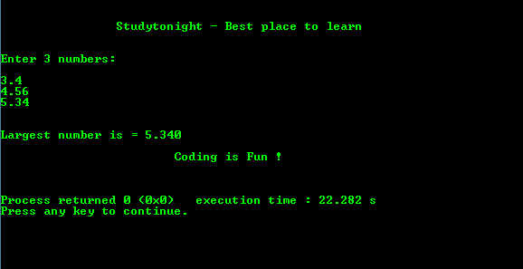

# 求三个数中最大值的 C 程序

> 原文：<https://www.studytonight.com/c/programs/important-concepts/largest-of-three-numbers>

下面是一个在三个用户输入数字中找出最大数字的程序。

```cpp
#include<stdio.h>

int main()
{
    printf("\n\n\t\tStudytonight - Best place to learn\n\n\n");
    float a, b, c;

    printf("Enter 3 numbers:\n\n");
    scanf("%f%f%f", &a, &b, &c);

    if(a >= b && a >= c)
    {
        /*
            %.3f prints the floating number 
            upto 3 decimal places
        */
        printf("\n\nLargest number = %.3f ", a);
    }
    else if(b >= a && b >= c)
    {
        printf("\n\nLargest number is = %.3f", b);
    }
    else
    {
        printf("\n\nLargest number is = %.3f", c);
    }

    printf("\n\n\t\t\tCoding is Fun !\n\n\n");
    return 0;
}
```

### 输出:



* * *

* * *