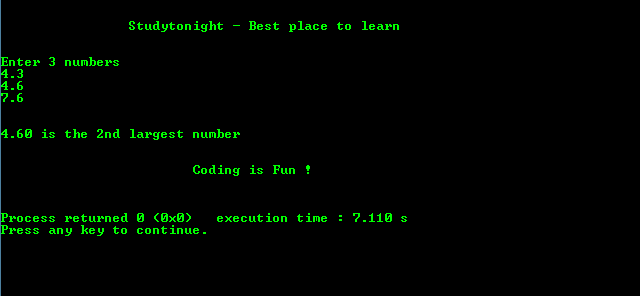

# C 程序：在三个用户输入数字中找出第二大数字

> 原文：<https://www.studytonight.com/c/programs/important-concepts/second-largest-among-three-numbers>

`.2lf`将数字限制在小数点后两位

下面是一个使用嵌套 if-else 循环从三个用户输入数字中找出第二大数字的程序:

```cpp
#include<stdio.h>

int main()
{
    printf("\n\n\t\tStudytonight - Best place to learn\n\n\n");

    double a, b, c;

    printf("Enter 3 numbers:\n");
    scanf("%lf%lf%lf", &a, &b, &c);  //lf is a format specifier to take double as input

    // a is the largest
    if(a >= b && a >= c)
    {
        if(b >= c)
        {
            /*
                .2lf restricts the number till 
                2 decimal places
            */
            printf("\n\n%.2lf is the 2nd largest number\n", b);
        }
        else
        {
            printf("\n\n%.2lf is the 2nd largest number\n", c);
        }
    }
    else if(b >= a && b >= c)
    {
        if(a >= c)
        {
            printf("\n\n%.2lf is the 2nd largest number\n",a);
        }
        else
        {
            printf("\n\n%.2lf is the 2nd largest number\n",c);
        }
    }

    // c is the largest number of the three
    else if(a >= b)
    {
        printf("\n\n%.2lf is the 2nd largest number\n", a);
    else
    {
        printf("\n\n%.2lf is the 2nd largest number\n", b);
    }

    printf("\n\n\t\t\tCoding is Fun !\n\n\n");
    return 0;
}
```

### 输出:



* * *

* * *