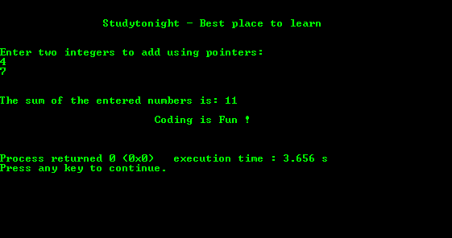

# 使用指针相加两个用户输入数字的程序

> 原文：<https://www.studytonight.com/c/programs/important-concepts/adding-two-numbers-using-pointers>

需要记住的几个要点:

*   `*`运算符在给定的地址位置返回的**值。**
*   `&`运算符将给定值返回的**地址。**

下面是一个用指针加两个数字的程序。

```cpp
#include<stdio.h>

int main()
{
    printf("\n\n\t\tStudytonight - Best place to learn\n\n\n");
    int first, second, *p , *q, sum;
    printf("Enter two integers to add using pointers:\n");
    scanf("%d%d", &first, &second);
    p = &first;
    q = &second;
    sum = *p + *q;
    printf("\n\nThe sum of the entered numbers is: %d", sum);
    printf("\n\n\t\t\tCoding is Fun !\n\n\n");
    return 0;
}
```

### 输出:



* * *

* * *