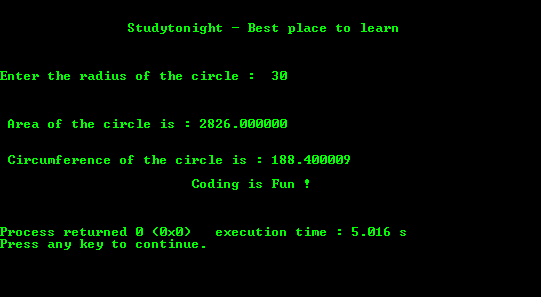

# C 程序：求圆的面积和周长

> 原文：<https://www.studytonight.com/c/programs/important-concepts/area-and-circumference-of-a-circle>

下面是一个求圆的面积和周长的程序。

```cpp
#include<stdio.h>

int main()
{
    printf("\n\n\t\tStudytonight - Best place to learn\n\n\n");
    int rad;
    float PI = 3.14, area, ci;
    printf("\nEnter the radius of the circle: ");
    scanf("%d", &rad);
    area = PI*rad*rad;
    printf("\n\n\n Area of the circle is: %f ", area);
    ci = 2*PI*rad;
    printf("\n\n\n Circumference of the circle is: %f", ci);
    printf("\n\n\t\t\tCoding is Fun !\n\n\n");
    return 0;
}
```

### 输出:



* * *

* * *