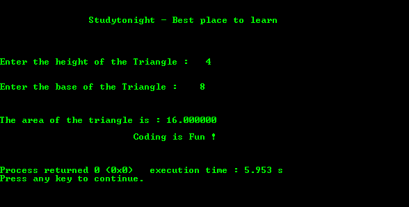
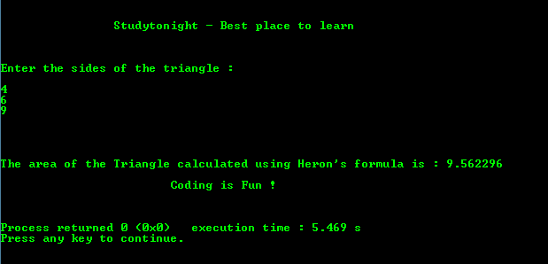

# C 程序：使用底和高求三角形面积

> 原文：<https://www.studytonight.com/c/programs/important-concepts/area-of-triangle>

下面是一个利用底和高来计算三角形面积的程序。

```cpp
#include<stdio.h>

int main()
{
    printf("\n\n\t\tStudytonight - Best place to learn\n\n\n");
    int h, b;
    float area;
    printf("\n\nEnter the height of the Triangle: ");
    scanf("%d", &h);
    printf("\n\nEnter the base of the Triangle: ");
    scanf("%d", &b);

    /*
        Formula for the area of the triangle = (height x base)/2

        Also, typecasting denominator from int to float 
        to get the output in float
    */
    area = (h*b)/(float)2;
    printf("\n\n\nThe area of the triangle is: %f", area);

    printf("\n\n\t\t\tCoding is Fun !\n\n\n");
    return 0;
}
```

### 输出:



* * *

## 用赫伦公式求三角形面积的程序

下面是一个用 heron 公式求三角形面积的程序。

```cpp
#include<stdio.h>
#include<math.h>  // to use sqrt() function

int main()
{
    printf("\n\n\t\tStudytonight - Best place to learn\n\n\n");
    double a, b, c, area, s;
    printf("\nEnter the sides of the triangle:\n\n");
    scanf("%lf%lf%lf", &a, &b, &c);   // lf is format specifier for double input

    s = (a+b+c)/2;
    /*
        sqrt is a predefined system function that 
        returns the square root of the input value
    */
    area = sqrt(s*(s-a)*(s-b)*(s-c));
    printf("\n\n\n\nThe area of the Triangle calculated using Heron's formula is: %lf", area);

    printf("\n\n\t\t\tCoding is Fun !\n\n\n");
    return 0;
}
```

### 输出:



* * *

* * *