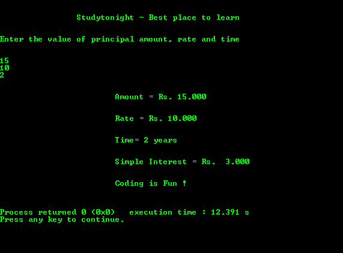

# 计算单利的 c 程序

> 原文:[https://www . study south . com/c/programs/重要-概念/简单-兴趣-程序](https://www.studytonight.com/c/programs/important-concepts/simple-interest-program)

下面是一个计算给定本金、利率和持续时间的简单利息的程序。

`%7.3f`表示浮点值用 7 位数字表示，包括小数点后的 3 位数字。

```cpp
#include<stdio.h>

void main()
{
    printf("\n\n\t\tStudytonight - Best place to learn\n\n\n");
    float principal_amt, rate, simple_interest;
    int time;
    printf("Enter the value of principal amount, rate and time\n\n\n");
    scanf("%f%f%d", &principal_amt, &rate, &time);

    // considering rate is in percentage
    simple_interest = (principal_amt*rate*time)/100.0;

    // usually used to align text in form of columns in table
    printf("\n\n\t\t\tAmount = Rs.%7.3f\n ", principal_amt);

    printf("\n\n\t\t\tRate = Rs.%7.3f\n ", rate);
    printf("\n\n\t\t\tTime= %d years \n", time);
    printf("\n\n\t\t\tSimple Interest = Rs.%7.3f\n ", simple_interest);
    printf("\n\n\t\t\tCoding is Fun !\n\n\n");
    return 0;
}
```

### 输出:



* * *

* * *