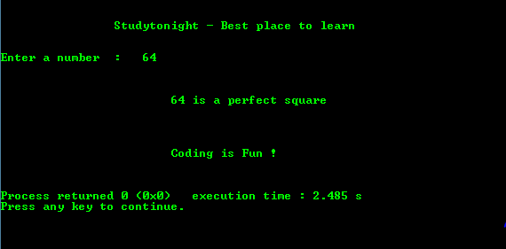

# C 程序：检查完全平方

> 原文：<https://www.studytonight.com/c/programs/important-concepts/checking-for-perfect-square>

下面是一个检查用户输入的数字是否是一个完全平方的程序。

```cpp
#include<stdio.h>
int main()
{
    printf("\n\n\t\tStudytonight - Best place to learn\n\n\n");

    // variable declaration
    int i, number;

    // take user input
    printf("Enter a number: ");
    scanf("%d", &number);

    // loop to check number is perfect square or not
    for(i = 0; i <= number; i++)
    {
        if(number == i*i)
        {
            printf("\n\n\n\t\t\t%d is a perfect square\n\n\n", number);

            printf("\n\n\t\t\tCoding is Fun !\n\n\n");
            return 0;   // same as using break in this case to end the program
        }
    }
    printf("\n\n\n\t\t\t%d is not a perfect square\n", number);
    printf("\n\n\t\t\tCoding is Fun !\n\n\n");
    return 0;
}
```

### 输出:



* * *

* * *