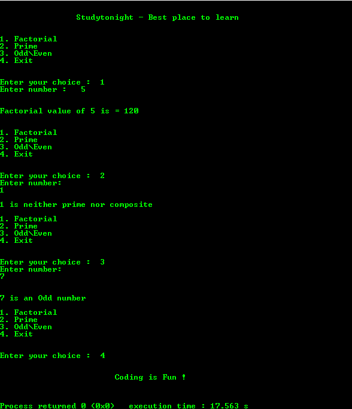

# 使用`switch-case`创建菜单驱动软件的 c 程序

> 原文：<https://www.studytonight.com/c/programs/misc/menu-driven-program>

下面是一个使用`switch-case`的菜单驱动程序。

`unsigned`是有符号的两倍大小，因为它只考虑正值。

`%lu`是无符号整数的格式说明符。

可被 1 以外的整数整除的数，其本身称为**合成数**。

```cpp
#include<stdio.h>

int main()
{
    printf("\n\n\t\tStudytonight - Best place to learn\n\n\n");
    int choice, num, i;
    unsigned long int fact;

    while(1)
    {
        printf("1\. Factorial \n");
        printf("2\. Prime\n");
        printf("3\. Odd\\Even\n");
        printf("4\. Exit\n\n\n");
        printf("Enter your choice :  ");
        scanf("%d",&choice);

        switch(choice)
        {
            case 1:
                printf("Enter number:\n");
                scanf("%d", &num);
                fact = 1;
                for(i = 1; i <= num; i++)
                {
                    fact = fact*i;
                }
                printf("\n\nFactorial value of %d is = %lu\n\n\n",num,fact);
                break;

            case 2:
                printf("Enter number:\n");
                scanf("%d", &num);
                if(num == 1)
                printf("\n1 is neither prime nor composite\n\n");
                for(i = 2; i < num; i++)
                {
                    if(num%i == 0)
                    {
                        printf("\n%d is not a prime number\n\n", num);
                        break;
                    }

                }
                /*
                    Not divisible by any number other 
                    than 1 and itself
                */
                if(i == num) 
                {
                    printf("\n\n%d is a Prime number\n\n", num);
                    break;
                }

            case 3:
                printf("Enter number:\n");
                scanf("%d", &num);

                if(num%2 == 0) // 0 is considered to be an even number
                    printf("\n\n%d is an Even number\n\n",num);
                else
                    printf("\n\n%d is an Odd number\n\n",num);
                break;

            case 4:
                printf("\n\n\t\t\tCoding is Fun !\n\n\n");
                exit(0);    // terminates the complete program execution
        }
    }
    printf("\n\n\t\t\tCoding is Fun !\n\n\n");
    return 0;
}
```

### 输出:



* * *

* * *