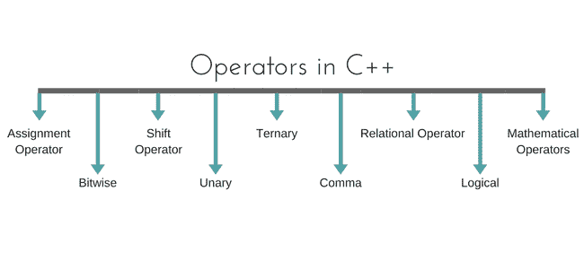

# C++ 中的运算符

> 原文：<https://www.studytonight.com/cpp/operators-and-their-types.php>

运算符是特殊类型的[函数](functions-in-cpp)，它接受一个或多个参数并产生一个新值。例如:加法(+)、减法(-)、乘法(*)等都是运算符。运算符用于对变量和常量执行各种操作。



* * *

## 运算符的类型

1.  赋值运算符
2.  数学运算符
3.  关系运算符
4.  逻辑运算符
5.  按位运算符
6.  移位运算符
7.  一元运算符
8.  三元算子
9.  逗点算符

* * *

### 赋值运算符(`=`)

Operates ' = '用于赋值，它取右侧(称为右值)并将其复制到左侧(称为左值)。赋值运算符是唯一可以重载但不能继承的运算符。

* * *

### 数学运算符

有用于执行基本数学运算的运算符。加法(+)、减法(-)、分流(/)乘法(*)和模(%)是基本的数学运算符。模数运算符不能用于浮点数。

C++ 和 [C](/c/overview-of-c.php) 也使用速记符号来执行相同类型的运算和赋值。*例*，

```cpp
int x=10;
x += 4 // will add 4 to 10, and hence assign 14 to X. 
x -= 5 // will subtract 5 from 10 and assign 5 to x. 
```

* * *

### 关系运算符

这些运算符建立操作数之间的关系。关系运算符有:小于()、小于或等于(<=), greater than equal to (> =)、等价(==)和不等价(！=).

您必须注意到赋值运算符是(=)，并且有一个关系运算符，表示等价的(==)。这两者互不相同，赋值运算符将值赋给任何[变量](variables-scope-details.php)，而等效运算符用于比较值，就像在 if-else 条件中一样，*示例*

```cpp
int x = 10;  //assignment operator
x=5;         // again assignment operator 
if(x == 5)   // here we have used equivalent relational operator, for comparison
{
    cout <
```

* * *

### 逻辑运算符

逻辑运算符是 AND (&&)和 OR (||)。它们用于将两个不同的表达式组合在一起。

如果两个语句使用“与”运算符连接，将考虑这两个语句的有效性，但是如果它们使用“或”运算符连接，则其中任何一个都必须有效。这些运算符主要用于[循环](loops-in-cpp)(尤其是`while`循环)和决策。

* * *

### 按位运算符

它们用于将单个位转换成一个数字。它们只处理整数[数据类型](datatypes-and-modifiers-in-cpp.php)，如`char`、`int`和`long`，而不处理浮点值。

*   按位“与”运算符`&`
*   按位或运算符`|`
*   和逐位异或运算符`^`
*   并且，按位非运算符`~`

它们也可以用作速记符号，`& =`、`|=`、`^=`、`~=`等。

* * *

### 移位运算符

移位运算符用于移位任何变量的位。它有三种类型，

1.  左移运算符 `<<`
2.  右移运算符 `>>`
3.  无符号右移位运算符 `>>>`

* * *

### 一元运算符

这些运算符只对一个操作数起作用。一元运算符很多，但使用最多的是递增`++`和递减`--`运算符。

**其他一元运算符:**地址为`&`，取消引用`*`，**新增**和**删除**，按位不`~`，逻辑不`!`，一元减`-`和一元加`+`。

* * *

### 三元算子

三元 if-else `? :`是一个有三个操作数的运算符。

```cpp
int a = 10;
a > 5 ? cout << "true" : cout << "false"
```

* * *

### 逗点算符

这用于分隔变量名和表达式。在表达式的情况下，生成并使用最后一个表达式的值。

*例*:

```cpp
int a,b,c; // variables declaration using comma operator
a=b++, c++; // a = c++ will be done. 
```

* * *

* * *