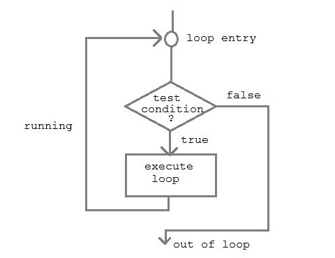

# C++循环- while，for 和 do while 循环

> 原文：<https://www.studytonight.com/cpp/loops-in-cpp>

在任何编程语言中，循环用于重复执行一组语句，直到满足特定条件。

* * *

## 它是如何工作的



执行一系列语句，直到指定条件为真。要执行的语句序列保存在花括号`{ }`中，称为循环体。每次执行循环体后，检查条件，如果发现**为真**，则再次执行循环体。当条件检查为**假**时，不执行循环体。

* * *

### 在 C++语言中有 3 种类型循环

1.  *而*循环
2.  *为*回路
3.  *边做边*循环

* * *

### `while`循环

**而**循环可以被称为**入口控制**循环。它分三步完成。

*   变量初始化。(例如`int x=0;`)
*   条件(例如`while( x<=10)`)
*   可变增量或减量(`x++`或`x--`或`x=x+2`

**语法:**

```cpp
variable initialization;
while (condition)
{
    statements;
    variable increment or decrement; 
} 
```

* * *

### `for`循环

`for`循环用于重复执行一组语句，直到满足特定条件。我们可以称之为**开环。**一般格式是，

```cpp
for(initialization; condition; increment/decrement)
{
    statement-block;
}
```

在`for`循环中，我们正好有两个分号，一个在初始化之后，第二个在条件之后。在这个循环中，我们可以有多个初始化或增量/减量，用逗号运算符分隔。**对于**回路只能有一个**条件**。

* * *

### 嵌套`for`循环

我们还可以为循环嵌套**，即一个**循环位于另一个**循环内，用于**循环。基本语法是，****

```cpp
for(initialization; condition; increment/decrement)
{
    for(initialization; condition; increment/decrement)
    {
        statement;
    }
}
```

* * *

### `do...while`循环

在某些情况下，有必要在测试条件之前执行循环体。这种情况可以借助 **do-while** 循环来处理。 **do** 语句首先评估循环体，最后使用**和**语句检查条件。 **do-while** 循环的一般格式是，

```cpp
do
{
    // a couple of statements
}
while(condition);
```

* * *

## 跳出循环

有时，在执行循环时，一旦某个条件成立，即跳出循环，就必须跳过循环的一部分或离开循环。C 语言允许在一个循环中从一条语句跳到另一条语句，也允许跳出循环。

### 1) `break`语句

当在循环中遇到`break`语句时，循环立即退出，程序继续执行紧接着循环的语句。

### 2) `continue`语句

它使控件直接进入测试条件，然后继续循环过程。遇到继续时，光标离开当前循环，并从下一个循环开始。

* * *

* * *