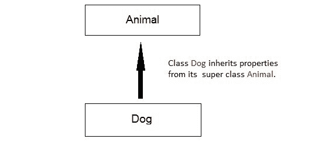

# C++ 中的继承

> 原文：<https://www.studytonight.com/cpp/overview-of-inheritance.php>

继承是一个[类](class-and-objects.php)从另一个类获取属性和特性的能力。属性被其他类继承的类称为**父类**或**基类**或**超类**类。并且，继承其他类属性的类称为**子**或**派生**或**子**类。

继承使代码可重用。当我们继承一个现有类时，它的所有方法和字段在新类中都变得可用，因此代码被重用。

**注意:**除了 Private 之外，类的所有成员都是继承的

* * *

## C++ 中继承的目的

1.  代码可重用性
2.  [方法覆盖](function-overriding.php)(因此，运行时多态性。)
3.  虚拟关键字的使用

* * *

### 继承的基本语法

```cpp
 class Subclass_name : access_mode Superclass_name 
```

在定义这样的子类时，必须在子类声明之前已经定义或至少声明了超类。

访问模式用于指定超类的属性继承到子类、公共类、私有类或受保护类的模式。

* * *

### 继承的例子

每当我们想在一个新的类中使用现有类中的东西时，我们可以使用 Inheritace 上的概念。这里有一个简单的例子，



```cpp
class Animal
{ 
    public:
    int legs = 4;
};

// Dog class inheriting Animal class
class Dog : public Animal
{ 
    public:
    int tail = 1;
};

int main()
{
    Dog d;
    cout << d.legs;
    cout << d.tail;
} 
```

4 1

* * *

## 访问修饰符和继承:类成员的可见性

根据继承时使用的访问修饰符，子类中超类成员的可用性会发生变化。它可以是私有的、受保护的或公共的。

### 1)公共继承

这是最常用的继承模式。在这种情况下，超类的受保护成员成为子类的受保护成员，而公共成员成为公共成员。

```cpp
class Subclass : **public** Superclass
```

### 2)私有继承

在私有模式下，超类的受保护成员和公共成员成为派生类的私有成员。

```cpp
class Subclass : Superclass   // By default its private inheritance
```

### 3)受保护的继承

在受保护模式下，超级类的公共成员和受保护成员成为子类的受保护成员。

```cpp
class subclass : **protected** Superclass
```

* * *

### 显示所有可见性模式的表格

|  | 衍生类别 | 衍生类别 | 衍生类别 |
| --- | --- | --- | --- |
| 基类 | 公共模式 | 私人模式 | 保护模式 |
| --- | --- | --- | --- |
| 私人的 | 未继承 | 未继承 | 未继承 |
| 保护 | 保护 | 私人的 | 保护 |
| 公众 | 公众 | 私人的 | 保护 |

* * *

* * *