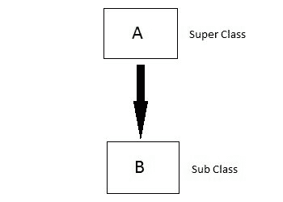
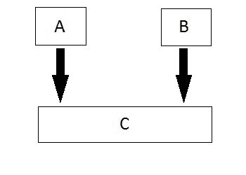
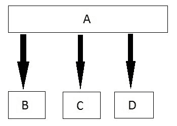
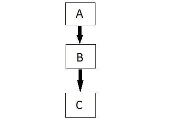
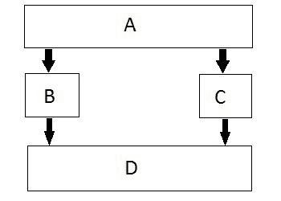

# C++中的继承类型

> 原文:[https://www.studytonight.com/cpp/types-of-inheritance.php](https://www.studytonight.com/cpp/types-of-inheritance.php)

在 C++中，我们有 5 种不同类型的[继承](overview-of-inheritance.php)。也就是说，

1.  单一继承
2.  多重继承
3.  分级继承
4.  多级继承
5.  混合继承(也称为虚拟继承)

* * *

## C++中的单一继承

在这种类型的继承中，一个派生类只从一个基类继承。这是最简单的继承形式。

* * *

## C++中的多重继承

在这种类型的继承中，单个派生类可以从两个或两个以上的基类继承。

* * *

## C++中的层次继承

在这种类型的继承中，多个派生类从单个基类继承。

* * *

## C++中的多级继承

在这种类型的继承中，派生类从一个类继承，该类又从其他类继承。一个是超级类，另一个是子类。

* * *

## C++中的混合(虚拟)继承

混合继承是层次继承和多层次继承的结合。

* * *

* * *