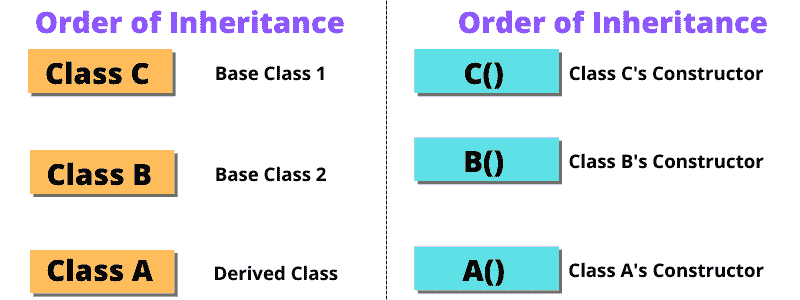

# C++中带继承的构造函数调用顺序

> 原文:[https://www . study south . com/CPP/order-of-constructor-call . PHP](https://www.studytonight.com/cpp/order-of-constructor-call.php)

在本教程中，我们将学习 [C++](https://www.studytonight.com/cpp/) 中[构造函数](https://www.studytonight.com/cpp/constructors-and-destructors-in-cpp)带继承调用的**顺序。**如果不熟悉 C++中的构造函数，可以从 [C++构造函数](https://www.studytonight.com/cpp/constructors-and-destructors-in-cpp.php)教程中了解。



## 派生类构造函数中的基类默认[构造函数](https://www.studytonight.com/cpp/constructors-and-destructors-in-cpp):

当我们从基类派生一个类时，基类的所有数据成员都将成为派生类的成员。我们使用构造函数来初始化数据成员，这里显而易见的情况是，当数据继承到派生类中时，谁将负责初始化它们？初始化继承的数据成员构造函数是必要的，这就是为什么首先调用基类的构造函数。在下面给出的程序中，我们可以看到继承中构造函数的执行顺序如下:

```cpp
#include <iostream>
using namespace std;
class Base
{
   int x;

public:
   // default constructor
   Base()
   {
      cout << "Base default constructor\n";
   }
};

class Derived : public Base
{
   int y;

public:
   // default constructor
   Derived()
   {
      cout << "Derived default constructor\n";
   }
   // parameterized constructor
   Derived(int i)
   {
      cout << "Derived parameterized constructor\n";
   }
};

int main()
{
   Base b;
   Derived d1;
   Derived d2(10);
}
```

基础默认构造函数
基础默认构造函数
派生默认构造函数
基础默认构造函数
派生参数化构造函数

## 派生类构造函数中的基类参数化构造函数:

让我们看看如何在派生类中调用参数化构造函数，在派生类中定义参数化构造函数时，需要使用`**:**`运算符显式定义派生类的参数化构造函数的调用。

```cpp
#include <iostream>
using namespace std;
class Base
{ 
    int x;
    public:
    // parameterized constructor
    Base(int i)
    { 
        x = i;
        cout << "Base Parameterized Constructor\n";
    }
};

class Derived: public Base
{ 
    int y;
    public:
    // parameterized constructor
    Derived(int j):Base(j)
    { 
        y = j;
        cout << "Derived Parameterized Constructor\n";
    }
};

int main()
{
    Derived d(10) ;
}
```

基本参数化构造函数
派生参数化构造函数

这里有一些基本的规则来计算[c++](https://www.studytonight.com/cpp/)T3 中**带继承的构造函数调用顺序。**

*   施工总是从基础开始`class`。如果有多个基类，那么从最左边的基类开始构造。如果有`virtual`遗传，那么它被给予更高的优先权)。

*   然后构造成员字段。它们按照声明的顺序初始化

*   最后，构建`class`本身

*   析构函数的顺序正好相反

<u>**相关教程:**</u>

*   [OOPS 基本概念](https://www.studytonight.com/cpp/cpp-and-oops-concepts.php)

*   [c++入门](https://www.studytonight.com/cpp/class-and-objects.php)

*   [c++中的函数](https://www.studytonight.com/cpp/functions-in-cpp)

*   [c++中的引用](https://www.studytonight.com/cpp/references-in-cpp.php)

* * *

* * *