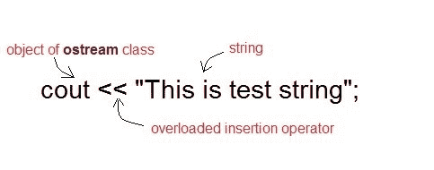
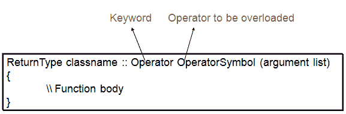

# C++ 中的运算符重载

> 原文：<https://www.studytonight.com/cpp/operator-overloading.php>

运算符重载是 C++ 中的一个重要概念。这是[多态性](function-overriding.php)，在这种多态性中，运算符被重载以赋予它用户定义的含义。重载运算符用于对用户定义的数据类型执行操作。例如，可以重载“+”运算符来对各种数据类型执行加法，如整数、字符串(串联)等。

几乎任何运算符都可以在 C++ 中重载。然而，很少有操作符不会过载。**未超载的运算符**如下

*   范围运算符- `::`
*   `sizeof`
*   成员选择器- `.`
*   成员指针选择器- `*`
*   三元运算符- `?:`

* * *

### 运算符重载语法

* * *

## 在 C++ 中实现运算符重载

运算符重载可以通过实现一个函数来完成，该函数可以是:

1.  成员函数
2.  非成员函数
3.  朋友功能

如果左操作数是该类的对象，运算符重载函数可以是[成员函数](member-functions-cpp.php)，但是如果左操作数不同，则运算符重载函数必须是非成员函数。

如果需要访问类的私有和受保护成员，运算符重载函数可以成为友元函数。

* * *

### C++ 中运算符重载的限制

以下是实现运算符重载时要记住的一些限制。

1.  运算符的优先级和结合性不能更改。
2.  Arity(操作数)不能更改。一元运算符保持一元，二元保持二元等。
3.  不能创建新的运算符，只能重载现有的运算符。
4.  不能重新定义过程的含义。您不能更改整数的添加方式。

* * *

* * *