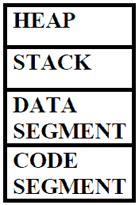
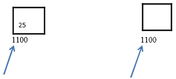

# C++中的动态内存分配

> 原文:[https://www . study south . com/CPP/memory-management-in-CPP . PHP](https://www.studytonight.com/cpp/memory-management-in-cpp.php)

以下是任何 C++程序使用的基本内存架构:



*   **代码段**:带有执行指令的编译程序保存在代码段中。它是只读的。为了避免堆栈和堆的过度写入，代码段保持在堆栈和堆的下面。
*   **数据段**:全局变量和静态变量保存在数据段中。它不是只读的。
*   **栈**:栈通常是预分配的内存。堆栈是后进先出数据结构。每个新变量都被推送到堆栈上。一旦变量超出范围，内存就会被释放。一旦堆栈变量被释放，该内存区域就可用于其他变量。当函数推送和弹出局部变量时，堆栈会增长和收缩。它存储本地数据、返回地址、传递给函数的参数以及内存的当前状态。
*   **堆**:程序执行时分配内存。使用新操作符分配内存，使用删除操作符释放内存。

* * *

## 使用`new`关键字分配堆内存

这里我们将学习如何使用`new`关键字为变量或类对象分配堆内存。

**语法:**

```cpp
datatype pointername = new datatype
```

例如:

```cpp
int *new_op = new int;
// allocating block of memory
int *new_op = new int[10];
```

如果在**堆**中没有足够的内存可用，则通过抛出类型为`std::bad_alloc`的异常来指示，并返回一个指针。

* * *

## 使用`delete`关键字释放内存

一旦使用`new`关键字将堆内存分配给变量或类对象，我们就可以使用`delete`关键字取消分配该内存空间。

**语法:**

```cpp
delete pointer variable
```

例如:

```cpp
delete new_op;
```

对象的范围或对象的生存期是在程序执行期间对象保留在内存中的时间。堆内存分配比**栈**慢。在堆中，内存分配没有特定的顺序，就像在堆栈中一样。

* * *

## 理解 C++中的内存泄漏

内存泄漏是由于内存分配和释放管理不善造成的。多发生在**动态内存分配**的情况下。C++中没有像 Java 那样的自动**垃圾收集**，所以程序员负责释放指针使用的内存。

现实生活中滥用建筑物中的电梯是内存泄漏的一个例子。假设你住在一栋 19 层的公寓楼里。你想去 10 层<sup>所以你按了按钮叫电梯。电梯状态显示为地下室 20 分钟。然后你意识到有些不对劲，经过调查你发现孩子们在地下室玩耍，他们堵住了电梯门。</sup>

类似地，一旦指针完成了它的操作，它应该释放它所使用的内存。以便其他变量可以使用内存，并且可以有效地管理内存。

通过使用`delete`关键字，我们可以删除分配的内存:

例如:

```cpp
*ex= new Example();
delete ex;
```

但是在上面的例子中**悬空指针**的问题可能会发生。等等！什么是悬空指针？

* * *

## 什么是悬空指针？

指向已删除对象的内存位置的指针被称为悬挂指针。



*   在第一幅图中，指针指向包含值 25 的存储单元 1100。
*   在第二幅图中，指针指向删除对象的存储位置。

悬空指针是由于对象破坏而产生的，当对象引用被删除或解除分配时，不修改指针的值，因此指针将继续指向相同的内存位置。这个问题可以通过将指针初始化为`NULL`来避免。

例如:

```cpp
*ex = new Example();
Delete ex;
// assigning the pointer to NULL
ex = NULL;
```

* * *

## 什么是智能指针？

智能指针用于管理动态分配对象的生存期。它们确保正确销毁动态分配的对象。智能指针在内存头文件中定义。

智能指针是内置指针，我们不用担心删除它们，它们是自动删除的。

下面是一个智能指针的例子:

```cpp
S_ptr *ptr = new S_ptr();
ptr->action();
delete ptr;
```

* * *

* * *