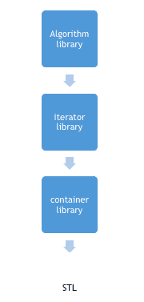

# STL 简介:标准模板库

> 原文：<https://www.studytonight.com/cpp/stl/stl-introduction>

STL 是标准模板库的缩写。它是一组 C++模板类，提供可用于实现数据结构和算法的泛型类和函数。STL 主要由以下部分组成:

1.  算法
2.  容器
3.  迭代程序

STL 提供了大量的容器和算法，在复杂编程中非常有用，例如在 STL 中使用容器库的列表容器，可以非常容易地在一条语句中定义一个链表，省时省力。

STL 是一个通用库，即相同的容器或算法可以在任何数据类型上操作，您不必为不同类型的元素定义相同的算法。

例如，排序算法将对给定范围内的元素进行排序，而不考虑它们的数据类型，我们不必为不同的数据类型实现不同的排序算法。

* * *

## c++:STL 中的算法

STL 提供了许多可以在任何容器中使用的算法，而不考虑它们的类型。算法库包含在数据结构上执行复杂算法的内置函数。

例如:可以用`reverse()`功能反转一个范围，用`sort()`功能排序一个范围，用`binary_search()`搜索一个范围等等。

算法库提供了抽象，也就是说你不一定需要知道算法是如何工作的。

* * *

## c++:STL 中的容器

STL 中的容器库提供了用于创建数据结构的容器，如数组、链表、树等。

这些容器是通用，它们可以保存任何数据类型的元素，例如: **vector** 可以用来创建 char、integer、float 和其他类型的动态数组。

* * *

## c++:STL 中的迭代器

STL 中的迭代器用于指向容器。迭代器实际上充当了容器和算法之间的桥梁。

例如:`sort()`算法有两个参数，开始迭代器和结束迭代器，现在 sort()比较这些迭代器中的每一个指向的元素，并按照排序的顺序排列它们，因此容器的类型是什么并不重要，相同的 sort()可以用于不同类型的容器。

* * *

## STL 的使用与应用

STL 是一个通用库，它提供了可用于存储和操作不同类型数据的容器和算法，因此它使我们不必从头定义这些数据结构和算法。因为有了 STL，现在我们不用每次做新程序都定义我们的排序函数，也不用为不同的数据类型定义同一个函数两次，取而代之的是我们可以只使用 STL 中的泛型容器和算法。

这在编程过程中节省了大量的时间、代码和精力，因此 STL 在竞争性编程中被大量使用，而且它可靠且快速。

* * *

* * *