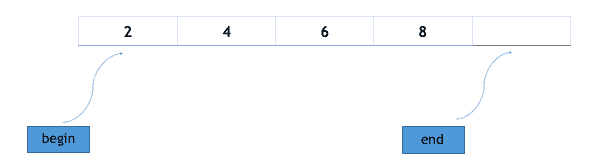

# STL 中的数组容器

> 原文：<https://www.studytonight.com/cpp/stl/stl-container-array>

众所周知，数组是同质对象的集合。STL 中的数组容器为我们提供了静态数组的实现，尽管它在竞争性编程中很少使用，因为它本质上是静态的，但我们仍然会讨论数组容器，因为它提供了一些成员函数和非成员函数，这使它比经典定义的数组有优势，比如 int array_name[array_size]。

数组容器的语法:

```cpp
array<object_type, array_size> array_name;
```

上面的代码创建了一个空的**对象类型**数组，其最大大小为**数组大小**。但是，如果要创建一个包含元素的数组，只需使用 `=` 操作符即可，下面是一个例子:

```cpp
#include <vector>

int main()
{
    array<int, 4> odd_numbers = { 2, 4, 6, 8 };
} 
```

上面的语句将创建一个数组，数组中的数据为 2，4，6，8。请注意，只有在 c++ 17 中才能使用`{}`括号进行初始化。

* * *

## 数组模板的成员函数

以下是数组模板中最重要和最常用的成员函数。

### `at`功能

此方法返回数组中给定范围内的值。如果给定范围大于数组大小，则抛出**超出范围**异常。下面的代码片段解释了这个操作符的用法:

```cpp
#include <iostream>
#include <array>

using namespace std;

int main ()
{
    array<int,10> array1 = {1,2,3,4,5,6,7,8,9};

    cout << array1.**at**(2)     // prints 3
    cout << array1.**at**(4)     // prints 5

}
```

### `[ ]`操作员

运算符 `[ ]` 的使用与普通数组相同。它返回数组中给定位置的值。示例:在上面的代码中，语句`cout << array1[5];`将在控制台上打印 6，因为 6 在数组 1 中有索引 5。

### `front()`功能

此方法返回数组中的第一个元素。

### `back()`功能

此方法返回数组中的最后一个元素。这里需要注意的是，如果数组没有完全填充，back()将返回数组中最右边的元素。

### `fill()`功能

此方法将给定值赋给数组的每个元素，例如:

```cpp
 #include <array>
int main()
{
    array<int,8> myarray;
    myarray.**fill**(1);
} 
```

这将在数组 myarray 的所有 8 个可用位置用值 1 填充数组 my array。

### `swap`功能

此方法交换相同类型和相同大小的两个数组的内容。它按索引方式交换，因此第一个数组的索引 **i** 的元素将与第二个数组的索引 **i** 的元素交换，如果交换这两个元素中的任何一个都需要 execption，swap()将引发异常。下面是一个演示其用法的示例:

```cpp
 #include <array>

int main()
{
    array<int,8> a = {1,2,3,4,5,6,7,8};
    array<int,8> b = {8,7,6,5,4,3,2,1};

    a.**swap**(b)  // swaps array a and b

    cout << "a is : ";
    for(int i=0; i < 8; i++) {
    cout << a[i] <<" ";
    }
    cout << endl;
    cout << "b is : ";
    for(int i=0; i < 8; i++) {
    cout << a[i] <<" ";
    }
    /* ouput will be 
    a is : 8 7 6 5 4 3 2 1
    b is : 1 2 3 4 5 6 7 8 */
} 
```

### 运算符(==，！=，>，< , > =，< =)

所有这些运算符都可以用来按字典顺序比较两个数组的值。

### `empty`功能

这个方法可以用来检查数组是否为空。

语法:`array_name.empty()`，如果数组为空则返回真，否则返回假。

### `size`功能

此方法返回数组中存在的元素数量。

### `max_size`功能

此方法返回数组的最大大小。

### `begin`功能

这个方法返回指向数组第一个元素的迭代器。迭代器就像指针，我们将在以后的课程中讨论它们，因为现在你可以把迭代器想象成指向数组的指针。



### `end`功能

这个方法返回一个迭代器，指向数组中最后一个元素旁边的元素，例如上面的数组有 4 个元素，end()调用将返回指向数组第 4 个索引的迭代器。

* * *

* * *