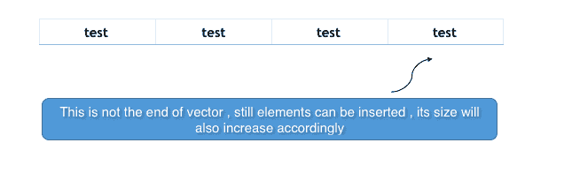
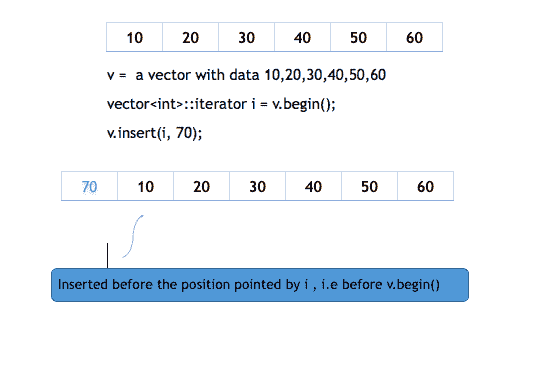
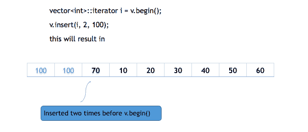
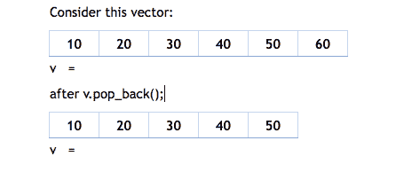

# STL 中的向量容器

> 原文：<https://www.studytonight.com/cpp/stl/stl-container-vector>

当我们必须实现像数组这样的顺序数据结构时，一个**数组**工作得很好，除了它是静态的，也就是说，我们必须在它的初始化期间定义它的最大大小，并且它不能包含大于它的最大大小的元素。现在假设，如果在程序执行期间，我们必须存储超过其大小的元素，或者如果我们正在读取元素的输入流，并且我们不知道元质数量的上限，则很有可能出现 **index_out_bound** 异常或程序意外终止。

我们可以做一件事，用编译器允许的最大尺寸初始化数组，即每个数组`10^6`个元素，但这是一种非常消耗空间的方法，如果要输入的元质数量太少，就会浪费空间，因此这种方法在编程中从未使用过。

上述问题的解决方案是动态数组！它们具有动态大小，即它们的大小可以在运行时改变。容器库提供**向量**来复制动态数组。

创建向量的语法是:`vector< object_type > vector_name;`

例如:

```cpp
#include <vector>

int main()
{
    std::**vector**<int> my_vector;
} 
```

Vector 是一个动态数组，在声明过程中不需要大小，因此上面的代码将创建一个空白向量。有很多方法可以初始化一个向量，

```cpp
#include <vector>

int main()
{
    std::**vector**<string> v {"Pankaj" ,"The" ,"Java" ,"Coder"};
} 
```


请注意，这种类型的初始化仅适用于 C++ 11 及更高版本。您也可以根据其他向量的范围初始化向量，例如:

```cpp
#include <vector>

int main()
{
    std::**vector**<string> v(v1.begin(), v1.end());
} 
```

上面的代码通过由 v1.begin()和 v2.end()返回的迭代器所指向的元素来初始化向量，begin()和 end()是我们用数组研究过的相同函数，它们对向量的工作方式相同。

您也可以用一个元素初始化一个向量一定次数，例如:

```cpp
#include <vector>

int main()
{
    std::**vector**<string> v(4 , "test");
} 
```



这些是初始化向量的方法之一，但是请记住，使用另一个向量或直接使用元素来初始化向量并不会限制它的大小，它的大小将始终是动态的，并且在需要时可以在向量中插入更多的元素。

* * *

## 向量的成员函数

以下是 STL 中矢量容器最常用的一些函数:

### `push_back`功能

`push_back()`用于在向量末尾插入一个元素。如果 push_back()中作为参数传递的对象类型与向量的类型不同，或者不可相互转换，则会引发异常。

下图将显示 push_back()的工作原理:


```cpp
#include <iostream>
#include <vector>

using namespace std;

int main()
{
    **vector**<int>  v;
    v.**push_back**(1);  *//insert 1 at the back of v*
    v.**push_back**(2);  *//insert 2 at the back of v*
    v.**push_back**(4);  *//insert 3 at the back of v*

    for(vector<int>::iterator i = v.begin(); i != v.end(); i++) 
    {
          cout << *i <<" ";   *// for printing the vector*
    }
} 
```

1 2 4

### `insert`功能

`insert(itr, element)`方法将向量中的元素插入迭代器 itr 指向的位置之前。

下图将展示插入是如何工作的:



**插入**函数可以被第三个参数重载，**计数**也一样。此 count 参数定义元素在指向位置之前插入的次数。



这个方法也可以用来插入给定范围内任何其他向量的元素，由两个迭代器指定，定义范围的起点和终点。

```cpp
v.insert(i, v2.begin(), v2.end());
```

上面的代码将在 **i** 所指向的索引之前插入从 v2.begin()到 v2.end()的元素。

### `pop_back`功能

pop_back()用于从向量中移除最后一个元素。它将向量的大小减少了一。

下面是一个例子:



```cpp
#include <iostream>
#include <vector>

using namespace std;

int main()
{
    **vector**<int> v1 {10,20,30,40};

    v1.**pop_back**();  

    vector<int>::iterator it;

    for(it = v.begin(); it != v.end(); it++) 
    {
        cout << *it <<" ";   // for printing the vector
    }
} 
```

10 20 30

### `erase`功能

`erase(itr_pos)`移除迭代器**指向的元素。erase 方法也可以重载一个额外的迭代器，指定要移除的范围的终点，即`erase(itr_start, itr_end)`。**

以下代码将说明擦除:

```cpp
#include <iostream>
#include <vector>

using namespace std;

int main()
{
    vecto<int>v1 {10,20,30,40};
    vector<int>iterator:: it = v.begin();

    v.**erase**(it);   //removes first element from the vector

    v.**erase**(v1.begin(), v1.end() - 2 )  
    /*removes all the elements except last two */

    for(it = v.begin(); it != v.end(); it++) 
    {
        cout << *it <<" ";   // for printing the vector
    }
}
```

30 40

### `resize`功能

`resize(size_type n, value_type val)`方法将向量调整到 **n** 元素。如果向量的当前大小大于 **n** ，则从向量中移除尾部元素，如果当前大小小于**n**n，则在向量后面插入额外的 **val** 元素。

例如，如果现在向量的大小为 4，元素为{10，20，30，40}，我们使用`resize`方法将其大小调整为 5。那么默认情况下，值为 **0** 的第五个元素将被插入到矢量中。我们可以指定数据不为零，在调用 resize 方法时将其显式地称为 **val** 。

### `swap`功能

这个方法交换两个向量的值。

如果我们有两个向量 v1 和 v2，我们想交换其中的元素，你只需要调用`v1.swap(v2)`，这将交换两个向量的值。

### `clear`功能

该方法清除整个向量，从向量中移除所有元素，但不删除向量。

语法:`clear()`

对于向量 **v** ，`v.clear()`会清除它，但不会删除它。

### `size`功能

这个方法返回向量的大小。

### `empty`功能

如果向量为空，此方法返回 true，否则返回 false。

### `capacity`功能

此方法根据分配给向量的内存返回可插入向量的元质数。

### `at`功能

这个方法在向量的情况下和在数组的情况下一样有效。`vector_name.at(i)`返回向量**向量 _ 名称**中带有索引的**处的元素。**

### `front`和`back`功能

`vector_name.front()`重新运行向量前面的元素(即最左边的元素)。而`vector_name.back()`返回向量后面的元素(即最右边的元素)。

* * *

* * *