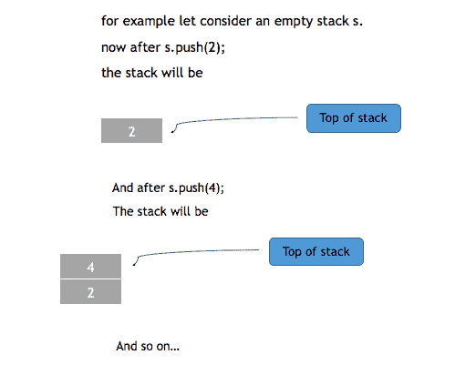
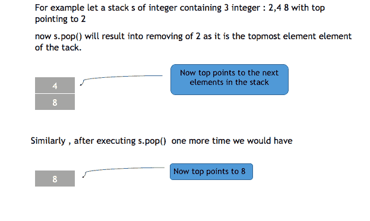

# C++ STL 中的堆栈容器

> 原文：<https://www.studytonight.com/cpp/stl/stl-container-stack>

堆栈容器用于在 c++中复制堆栈，插入和删除总是在堆栈的顶部执行。

要了解更多关于堆栈数据结构的信息，请访问:[堆栈数据结构](/data-structures/stack-data-structure)

以下是在 stl 中定义堆栈的语法:

```cpp
**stack**<object_type> *stack_name*; 
```

上面的语句将创建一个名为对象类型的堆栈名。

* * *

## 堆栈容器的成员函数

以下是 STL 中堆栈容器最常用的一些函数:

### `push`功能

push()用于将元素插入到堆栈中，元素被插入到堆栈的顶部。



```cpp
#include <iostream>      
#include <stack>

using namespace std;   

int main ()
{
    **stack**<int> s;   *// creates an empty stack of integer s* 

    s.**push**(2);   *// pushes 2 in the stack  , now top =2*
    s.**push**(3);   *// pushes 3 in the stack  , now top =3*

}
```

### `pop`功能

此方法用于从堆栈中移除单个元素。它将堆栈的大小减少了 1。移除的元素始终是堆栈的最顶层元素(最近添加的元素)。`pop()`方法不返回任何东西。



### `top`功能

此方法返回堆栈的最顶层元素。请注意，与 pop()不同，此方法返回元素，而不是移除它。

语法:`top()`

### `size`和`empty`功能

`size()`返回堆栈中存在的元素数量，而`empty()`检查堆栈是否为空。如果堆栈为空，则 empty 返回 true，否则返回 false。

### `swap`功能

此方法交换两个堆栈的元素。

```cpp
#include <iostream>      
#include <stack>

using namespace std;  

int main ()
{
    **stack**<int> s; 

    *// pushing elements into stack*
    s.**push**(2);   
    s.**push**(3);   
    s.**push**(4);   

    cout << s.**top**();   *// prints 4, as 4 is the topmost element* 

    cout << s.**size**();  *// prints 3, as there are 3 elements in* 
} 
```

* * *

* * *