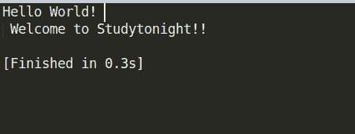

> 原文:[https://www . study south . com/CPP-programs/CPP-hello-world-program](https://www.studytonight.com/cpp-programs/cpp-hello-world-program)

# C++你好世界计划

大家好！

在本教程中，我们将学习如何用 C++编程语言编写一个基本的 Hello World 程序。

```cpp
#include<iostream>

using namespace std;

int main()
{
    cout << "Hello World! \n Welcome to Studytonight!!\n\n";
    return 0;
}
```

<u>**输出:**</u>



现在让我们看看我们在上面的程序中做了什么。

## C++你好世界计划解释:

为了更好地理解，让我们分解代码的各个部分。

### 1.`#include<iostream>`

行首的数字符号(#)指向编译器的预处理程序。
因此，在上述情况下，#include 告诉预处理器包含< iostream >头。

`<iostream>`头定义了获取输入和输出数据所需的库。

### 2.`using namespace std`

这告诉编译器使用标准(`std`)命名空间，它包括 C++标准库的特性。

### 3.`int main()`

类似于任何其他编程语言，在 C++中，程序的执行从主函数开始:`int main()`

### 4.`cout`声明

```cpp
cout << "Hello World! \n Welcome to Studytonight!!\n\n"
```

在 c++中，`iostream`头中定义的流用于输入和输出操作。

`cout <<`用于向屏幕显示输出。(类似于 C 语言中的`printf`语句)
`cin >>`用于从终端获取输入。(类似于 C 语言中的`scanf`语句)

### 5.`return 0`

主方法的返回类型是 int。因此，我们需要返回 0 来终止程序。

***保持学习:***

* * *

* * *