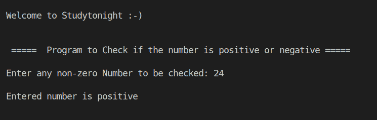

# C++ 检查数字是正数还是负数程序

> 原文：<https://www.studytonight.com/cpp-programs/cpp-check-if-the-number-is-positive-or-negative-program>

大家好！

在本教程中，我们将学习如何在 C++ 编程语言中**确定输入的数字是正数还是负数**。

这可以通过 C++ 中`**if-else**`块的概念来实现([学习 C++ if-else](https://www.studytonight.com/cpp/decision-making-in-cpp) )。

下面给出的注释代码将帮助您详细理解这个概念。

**代号:**

```cpp
#include <iostream>
using namespace std;

int main()
{
    cout << "\n\nWelcome to Studytonight :-)\n\n\n";
    cout << " =====  Program to Check if the number is positive or negative ===== \n\n";

    int num;

    //taking user input
    cout << "Enter any non-zero Number to be checked: ";
    cin >> num;

    //when the condition inside the if() is true, then it enters the code block
    if (num > 0)
    {
        cout << "\nEntered number is positive";
    }
    else //when if is not executed then it moves to the else block
    {
        cout << "\nEntered number is negative";
    }

    cout << "\n\n\n";

    return 0;
}
```

**输出:**



我们希望这篇文章能帮助你更好地理解 C++ 中`if else`块的逻辑。如有任何疑问，请随时通过下面的评论区联系我们。

**继续学习:**

* * *

* * *