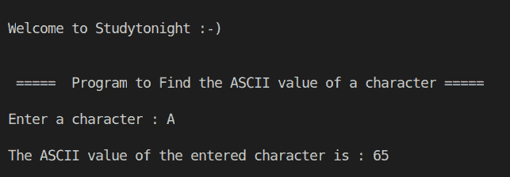

# C++ 程序：查找字符的 ASCII 值

> 原文：<https://www.studytonight.com/cpp-programs/cpp-find-the-ascii-value-of-the-character-program>

大家好！

在本教程中，我们将学习**如何在 C++ 编程语言中找到给定字符**的 ASCII 值。

## 程序逻辑:

利用类型铸造的概念可以很容易地做到这一点。

**类型转换**是指在访问变量时改变变量的数据类型。

**示例**:如果变量`**v**`为双精度类型，则可以通过以下代码访问其整数值:

```cpp
int a = (int) v;
```

为了更好地理解，请参考下面给出的代码:

**代号:**

```cpp
#include <iostream>

using namespace std;

int main()
{
    //variable declaration - a char variable takes a single character as input
    char c;

    cout << "\n\nWelcome to Studytonight :-)\n\n\n";
    cout << " =====  Program to Find the ASCII value of a character ===== \n\n";

    //take user input
    cout << "Enter a character : ";
    cin >> c;

    //printing the ASCII value of the entered character
    cout << "\nThe ASCII value of the entered character is : " << (int)c << "\n\n";

    return 0;
}
```

**输出:**



我们希望这篇文章能帮助你更好地理解在 C++ 中确定字符 ASCII 值时寻找类型转换的概念。如有任何疑问，请随时通过下面的评论区联系我们。

**继续学习:**

* * *

* * *