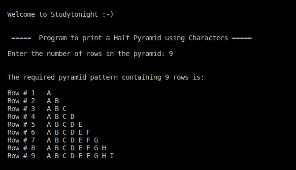

> 原文:[https://www . study south . com/CPP-programs/CPP-半金字塔-模式-使用字符-程序](https://www.studytonight.com/cpp-programs/cpp-half-pyramid-pattern-using-characters-program)

# 使用字符程序的 C++半金字塔模式

大家好！

在本教程中，我们将学习如何使用 C++编程语言中的字符打印半金字塔结构。

使用 ***** 或**字母**或**数字**的所有此类模式都是通过使用**嵌套循环结构**实现的，知道如何迭代以及迭代到哪里。

我们相信，本节涵盖的所有模式将帮助您理解这个概念，并在形成您自己的模式时更好地可视化它，因为这类问题在各种稍加修改的采访中经常被问到。

<u>**代号:**</u>

```cpp
#include <iostream>
using namespace std;

int main()
{
    cout << "\n\nWelcome to Studytonight :-)\n\n\n";
    cout << " =====  Program to print a Half Pyramid using Characters ===== \n\n";

    //i to iterate the outer loop and j for the inner loop
    int i, j, rows;

    //initializing and declaring the character to start each row with
    char c = 'A';

    cout << "Enter the number of rows in the pyramid: ";
    cin >> rows;
    cout << "\n\nThe required pyramid pattern containing " << rows << " rows is:\n\n";

    //outer loop is used to move to a particular row
    for (i = 1; i <= rows; i++)
    {
        //to display that the outer loop maintains the row number
        cout << "Row # " << i << "   ";

        c = 'A'; //as need to start each row with character 'A'.

        //inner loop is used to decide the number of * in a particular row
        for (j = 1; j <= i; j++)
        {
            cout << c << " "; //printing the column number within each row

            c+=1;// incrementing the ASCII value to move to the next character
        }

        cout << endl;
    }

    cout << "\n\n";

    return 0;
}
```

<u>**输出:**</u>



我们强烈建议您在开始编程之前先在纸上一行一行地画出这样的模式，因为这将帮助您更好地理解嵌套结构。

**继续学习:**

* * *

* * *