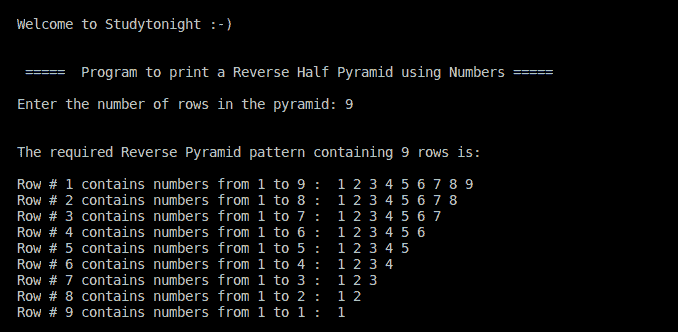

# C++ 使用数字的反向半金字塔图案

> 原文：<https://www.studytonight.com/cpp-programs/cpp-reverse-half-pyramid-pattern-using-numbers>

大家好！

在本教程中，我们将学习如何在 C++ 编程语言中使用数字打印反向半金字塔结构。

使用 ***** 或**字母**或**数字**的所有此类图案都是通过使用**嵌套循环结构**实现的，知道如何迭代以及迭代到哪里。

我们相信，本节涵盖的所有图案将帮助您理解这个概念，并在形成您自己的图案时更好地可视化它，因为这类问题在各种稍加修改的采访中经常被问到。

**代号:**

```cpp
#include <iostream>
using namespace std;

int main()
{
    cout << "\n\nWelcome to Studytonight :-)\n\n\n";
    cout << " =====  Program to print a Reverse Half Pyramid using Numbers ===== \n\n";

    //i to iterate the outer loop and j for the inner loop
    int i, j, rows;

    //to denote the range of numbers in each row
    int last; 

    cout << "Enter the number of rows in the pyramid: ";
    cin >> rows;
    cout << "\n\nThe required Reverse Pyramid pattern containing " << rows << " rows is:\n\n";

    //outer loop is used to move to a particular row
    for (i = 1; i <= rows; i++)
    {
        //to display that the outer loop maintains the row number
        cout << "Row # " << i << " contains numbers from 1 to " << (rows - i + 1) << " :  ";

        last  = rows -i + 1;
        //inner loop is used to decide the number of * in a particular row
        for (j = 1; j<= last; j++)
        {
            cout << j << " ";
        }

        cout << endl;
    }

    cout << "\n\n";

    return 0;
}
```

**输出:**



我们强烈建议您在开始编程之前先在纸上一行一行地画出这样的图案，因为这将帮助您更好地理解嵌套结构。

**继续学习:**

* * *

* * *