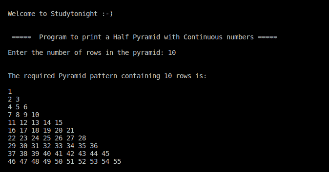

# C++ 弗洛伊德的三角程序

> 原文：<https://www.studytonight.com/cpp-programs/cpp-floyds-triangle-program>

大家好！

在本教程中，我们将学习如何用 C++ 编程语言**打印弗洛伊德的三角形**。

## 弗洛伊德的三角形是什么？

弗洛伊德的三角形是自然数的直角三角形数组。它是通过用连续数字填充三角形的行来定义的，从左上角的 1 开始:

使用 ***** 或**字母**或**数字**的所有此类模式都是通过使用**嵌套循环结构**实现的，知道如何迭代以及迭代到哪里。

我们相信，本节涵盖的所有模式将帮助您理解这个概念，并在形成您自己的模式时更好地可视化它，因为这类问题在各种稍加修改的采访中经常被问到。

<u>**代号:**</u>

```cpp
#include <iostream>
using namespace std;

int main()
{
    cout << "\n\nWelcome to Studytonight :-)\n\n\n";
    cout << " =====  Program to print a Half Pyramid with Continuous numbers ===== \n\n";

    //i to iterate the outer loop and j for the inner loop
    int i, j, rows, cols;

    //to denote the range of numbers in each row
    int n=1, first,last; 

    cout << "Enter the number of rows in the pyramid: ";
    cin >> rows;
    cout << "\n\nThe required Pyramid pattern containing " << rows << " rows is:\n\n";

    //outer loop is used to move to a particular row
    for (i = 1; i <= rows; i++)
    {

        first = n;
        last  = first + i -1;
        cols = i;

        //to display that the outer loop maintains the row number
        //cout << "Row # " << i << " contains the numbers from " << first << " to " << last << " :    ";

        //inner loop is used to decide the number of * in a particular row
        for (j = 1; j<= cols; j++)
        {
            cout << n << " ";
            n+=1;
        }

        cout << endl;
    }

    cout << "\n\n";
    return 0;
}
```

<u>**输出:**</u>



您可以通过**删除``//`` 来取消对下面显示的代码行**的注释，从而获得每行数字范围的详细信息。

```cpp
 //cout << "Row # " << i << " contains the numbers from " << first << " to " << last << " :    ";
```

我们强烈建议您在开始编程之前先在纸上一行一行地画出这样的模式，因为这将帮助您更好地理解嵌套结构。

**继续学习:**

* * *

* * *