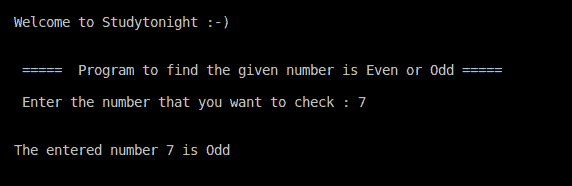

# C++检查给定的数字是偶数还是奇数

> 原文：<https://www.studytonight.com/cpp-programs/cpp-check-whether-the-given-number-is-even-or-odd>

大家好！

在本教程中，我们将学习如何在 C++编程语言中**检查给定的数字是偶数还是奇数**。

<u>**代号:**</u>

```cpp
#include <iostream>
using namespace std;

int main()
{
    cout << "\n\nWelcome to Studytonight :-)\n\n\n";
    cout << " =====  Program to find the given number is Even or Odd ===== \n\n";

    //variable declaration
    int n;

    //taking input from the command line (user)
    cout << " Enter the number that you want to check : ";
    cin >> n;

    //logic to check if the number is even or odd
    if(n % 2 == 0)
    {
        cout << "\n\nThe entered number "<< n << " is Even\n";
    }
    else
    {
        cout << "\n\nThe entered number "<< n << " is Odd\n";
    }

    cout << "\n\n\n";

    return 0;
}
```

<u>**输出:**</u>



现在让我们看看我们在上面的程序中做了什么。

## 程序解释:

为了更好地理解，让我们分解代码的各个部分。

```cpp
if(n % 2 == 0)
{
    cout << "\n\nThe entered number "<< n << " is Even\n";
}
else
{
    cout << "\n\nThe entered number "<< n << " is Odd\n";
}
```

代码片段表示确定给定数字是偶数还是奇数的逻辑。

实现这一点的方法有很多，但这里我们想介绍条件语句的逻辑`if else`以及模数运算`(%`的使用。

`if(condition)`:

当条件为**真**时，执行这部分代码。如果条件为**假**，那么代码将忽略代码的这一部分，转到下一行。

`n%2`:这里模数运算返回`n`除以 **2** 得到的余数。

根据偶数的定义，一个数除以 2 得到的余数必须是 **0** 。对于**奇数**，剩余部分必须是 **1** 。

**继续学习:**

* * *

* * *