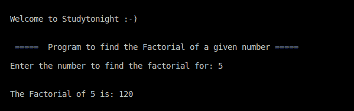

# 给定数字程序的 C++ 阶乘

> 原文：<https://www.studytonight.com/cpp-programs/cpp-factorial-of-a-given-number-program>

大家好！

在本教程中，我们将学习如何使用 C++ 编程语言找到给定数字的**阶乘。**

<u>**代号:**</u>

```cpp
#include <iostream>
using namespace std;

int main()
{
    cout << "\n\nWelcome to Studytonight :-)\n\n\n";
    cout << " =====  Program to find the Factorial of a given number ===== \n\n";

    //variable declaration
    int i,n;

    //as we are dealing with the product, it should be initialized with 1.
    int factorial=1;

    //taking input from the command line (user)
    cout << "Enter the number to find the factorial for: ";
    cin >> n;

    //finding the factorial by multiplying all the numbers from 1 to n
    for (i = 1; i <= n; i++)
    {
        factorial *= i; // same as factorial = factorial * i 
    }

    cout << "\n\nThe Factorial of " << n << " is: " << factorial;

    cout << "\n\n\n";

    return 0;
}
```

<u>**输出:**</u>



现在让我们看看我们在上面的程序中做了什么。

## 程序解释:

为了更好地理解，让我们分解代码的各个部分。

### 数学中的阶乘是什么？

数学中**正整数 n** 的阶乘，用 **n 表示！**，是所有小于或等于 n 的正整数的乘积:

**注:**

1.  阶乘仅针对**非负数**定义。(> =0)

2.  0 阶乘的值是 1。( **0！= 1** )

```cpp
 //as we are dealing with the product, it should be initialized with 1.
    int factorial=1; 
```

因为阶乘只为非负整数定义，所以它总是产生一个正整数值。此外，由于乘法运算包含在下面给出的逻辑中，因此将其初始化为 1。

### 1.使用 C++ 寻找阶乘的逻辑:

```cpp
// finding the factorial by multiplying all the numbers from 1 to n
for (i = 1; i <= n; i++)
{
    factorial *= i; // same as factorial = factorial * i
}
```

根据上面的定义，我们需要取从 1 开始的所有数字与数字本身的乘积。循环是实现这一点的最佳方式。

`factorial *= i;`

这与`factorial = factorial * i`相同，但编码方式更简单。

这适用于所有数学运算，如 `**+**`、`**-**`、`**/**`、`**%**`。

我建议你在自己身上尝试一下，以便更好地理解。

***保持学习:***

* * *

* * *