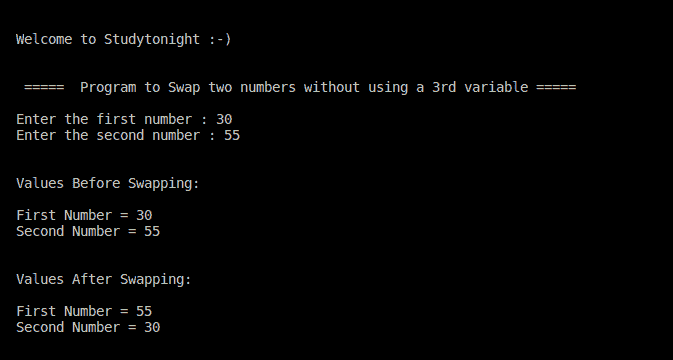

# C++ 不使用第三个变量交换两个数字

> 原文：<https://www.studytonight.com/cpp-programs/cpp-swap-two-numbers-without-using-a-3rd-variable>

大家好！

在本教程中，我们将学习如何在不使用第三个变量的情况下，用 C++ 编程语言**交换两个数字。**

**代号:**

```cpp
#include <iostream>
using namespace std;

int main()
{
    cout << "\n\nWelcome to Studytonight :-)\n\n\n";
    cout << " =====  Program to Swap two numbers without using a 3rd variable ===== \n\n";

    // variable declaration
    int a,b;

    //taking input from the command line (user)
    cout << "Enter the first number : ";
    cin >> a;

    cout << "Enter the second number : ";
    cin >> b;

    cout << "\n\nValues Before Swapping:  \n"<<endl;
    cout << "First Number = " << a <<endl;
    cout << "Second Number = " << b <<endl;

    // Logic for swapping the two numbers 
    // without using any extra variable
    a = a + b;
    b = a - b;
    a = a - b;

    cout << "\n\nValues After Swapping:  \n"<<endl;

    cout << "First Number = " << a <<endl;
    cout << "Second Number = " << b <<endl;
    cout << "\n\n\n";

    return 0;
} 
```

**输出:**



现在让我们看看我们在上面的程序中做了什么。

## 程序解释:

为了更好地理解，让我们分解代码的各个部分。

```cpp
//Logic for swapping the two numbers without using any extra variable
a = a + b;
b = a - b;
a = a - b;
```

这里涉及的逻辑是，与其他编程语言类似，C++ 中的**变量存储最近存储到其中的值。**

为了理解上面的逻辑，让我们使用一些伪值。

最初，`a = 30`，`b=55`，

然后我们这样做，`a = a + b`，那么存储在 a 中的新值是:

```cpp
a = 30 + 55
```

然后， `b = a - b`，这里的 a 将是最近存储的值。

所以， **b = (30 + 55) - 55 = 30**

即**b = 30**(a 的初始值)

最终我们做到了，`a = a - b`，

所以， **a = (30 + 55) - 30 = 55**

即**a = 55**(b 的初始值)

所以如你所见，我们已经将`a`和`b`的初始值互换了。

***保持学习:***

* * *

* * *