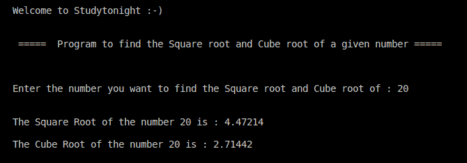

# 给定数字的平方根和立方根

> 原文：<https://www.studytonight.com/cpp-programs/cpp-square-root-and-cube-root-of-a-given-number>

大家好！

在本教程中，我们将学习如何在 C++ 编程语言中分别利用系统定义的函数 **`sqrt()`** 和 **`cbrt()`** 找到给定数字的**平方根**和**立方根**。

**代号:**

```cpp
#include <iostream>
#include <cmath> // library which has predefined methods sqrt() and cbrt()

using namespace std;

int main()
{
    cout << "\n\nWelcome to Studytonight :-)\n\n\n";
    cout << " =====  Program to find the Square root and Cube root of a given number ===== \n\n";

    // variable declaration
    int n;
    // variable initialization and declaration
    double sq = 1, cb = 1;
    // taking input from the command line (user)
    cout << " \n\nEnter the number you want to find the Square root and Cube root of : ";
    cin >> n;

    // Finding the square root and the cube root using the system defined methods
    sq = sqrt(n);
    cb = cbrt(n);

    cout << " \n\nThe Square Root of the number " << n << " is : " << sq;
    cout << " \n\nThe Cube Root of the number " << n << " is : " << cb;
    cout << "\n\n\n";

    return 0;
} 
```

**输出:**



**继续学习:**

* * *

* * *