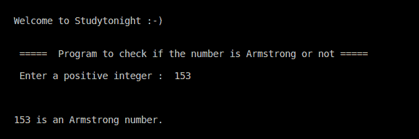

> 原文:[https://www . study south . com/CPP-programs/CPP-check-number-是不是阿姆斯特朗](https://www.studytonight.com/cpp-programs/cpp-check-whether-the-number-is-armstrong-or-not)

# C++检查号码是不是阿姆斯特朗

大家好！

在本教程中，我们将学习如何在 C++编程语言中**检查给定的数字是否是阿姆斯特朗**。

### 什么是阿姆斯特朗号码？

在数论中，给定基数上的阿姆斯壮数是一个数，它是其各自位数的和，每个位数都是位数的幂。(在编程中，我们通常将其定义为 3 位数)

**示例:**

**153 是阿姆斯壮数字**为 1^3 + 5^3 + 3^3 = 1 + 125 + 27 = 153。(与原编号 153 相同)

但是， **213 不是阿姆斯壮号码**因为 2^3 + 1^3 + 3^3 = 8 + 1 + 27 = 36(不等于原来的号码 213)

<u>**代号:**</u>

```cpp
#include <iostream>
using namespace std;

int main()
{
    cout << "\n\nWelcome to Studytonight :-)\n\n\n";
    cout << " =====  Program to check if the number is Armstrong or not ===== \n\n";

    //variable declaration
    int n, n1, remainder, num = 0;

    //taking input from the command line (user) all at once
    cout << " Enter a positive integer :  ";
    cin >> n;

    //storing the original value before modifying it
    n1=n;

   //Logic to check if it is Armstrong or not for a 3 digit number
    while( n1!=0 )
    {
        remainder = n1 % 10; //storing the digits at the units place
        num += remainder*remainder*remainder;
        n1/=10; 
    }
    cout << "\n\n\n";

    if(num == n)
    {
        cout << n << " is an Armstrong number.";
    }
    else
    {
        cout << n << " is not an Armstrong number.";
    }   
    cout << "\n\n\n";

    return 0;
}
```

<u>**输出:**</u>



现在让我们看看我们在上面的程序中做了什么。

## 程序解释:

为了更好地理解，让我们分解代码的各个部分。

```cpp
//Logic to check if it is Armstrong or not for a 3 digit number
    while( n1!=0 )
    {
        remainder = n1 % 10; //storing the digits at the units place
        num += remainder*remainder*remainder;
        n1/=10;

    }
```

以上代码片段用于检查给定的 3 位数**是否为阿姆斯特朗**。

`remainder = n1 % 10;`

这用于将单位处的数字存储到余数变量中。

`num += remainder*remainder*remainder;`

这个语句用来执行立方运算，并与前一个和相加，得到给定 3 位数的所有数字的立方的最终和。

`n1/=10;`

该语句将实际数字除以 10，这样新值就只包含尚未探究的数字。

我们将建议您自行对此进行编程，**使用 153 号**的笔纸进行逐步分析，以获得更好的理解。

**继续学习:**

* * *

* * *