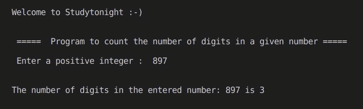

# C++ 计算给定数字的位数

> 原文：<https://www.studytonight.com/cpp-programs/cpp-count-number-of-digits-in-a-given-number>

大家好！

在本教程中，我们将学习如何使用 c++**确定给定数字**中的位数。

**代号:**

```cpp
#include <iostream>
using namespace std;

int main()
{
    cout << "\n\nWelcome to Studytonight :-)\n\n\n";
    cout << " =====  Program to count the number of digits in a given number ===== \n\n";

    //variable declaration
    int n, n1, num = 0;

    //taking input from the command line (user)
    cout << " Enter a positive integer :  ";
    cin >> n;

    n1 = n; //storing the original number

    //Logic to count the number of digits in a given number
    while (n != 0)
    {
        n /= 10; //to get the number except the last digit.
        num++; //when divided by 10, updated the count of the digits
    }

    cout << "\n\nThe number of digits in the entered number: " << n1 << " is " << num;
    cout << "\n\n\n";

    return 0;
}
```

**输出:**



我们希望这篇文章能帮助你更好地理解 C++ 中计算输入数字位数的逻辑。如有任何疑问，请随时通过下面的评论区联系我们。

**继续学习:**

* * *

* * *