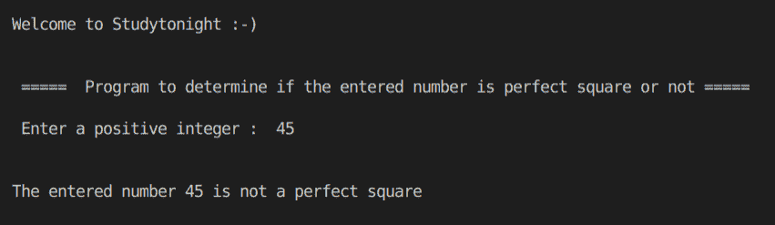
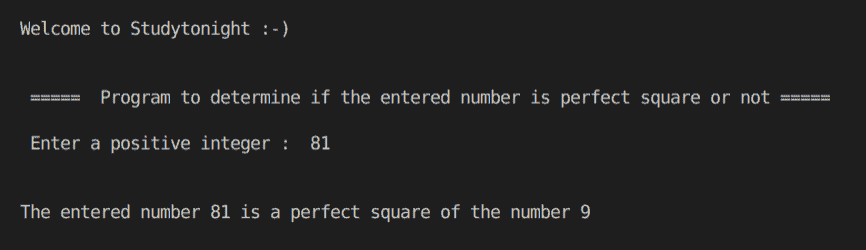

# C++ 程序：确定完全平方

> 原文：<https://www.studytonight.com/cpp-programs/cpp-determine-perfect-square-program>

大家好！

在本教程中，我们将演示 C++ 编程语言中**判断给定数字是否为完全平方的逻辑。**

**逻辑:**

`**sqrt(x)**`方法返回`x`的平方根。

为了更好地理解它的实现，请参考下面给出的评论很好的 CPP 代码。

**代号:**

```cpp
#include <iostream>
#include <math.h>

using namespace std;

// Returns true if the given number is a perfect square
bool isPerfectSquare(int n)
{
    // sqrt() method is defined in the math.h library 
    // to return the square root of a given number
    int sr = sqrt(n); 

    if (sr * sr == n)
        return true;
    else
        return false;
}

int main()
{
    cout << "\n\nWelcome to Studytonight :-)\n\n\n";
    cout << " =====  Program to determine if the entered number is perfect square or not ===== \n\n";

    // variable declaration
    int n;
    bool perfect = false;

    // taking input from the command line (user)
    cout << " Enter a positive integer :  ";
    cin >> n;

    // Calling a method that returns true if the 
    // number is a perfect square
    perfect = isPerfectSquare(n);

    if (perfect)
    {
        cout << "\n\nThe entered number " << n << " is a perfect square of the number " << sqrt(n);
    }
    else
    {
        cout << "\n\nThe entered number " << n << " is not a perfect square";
    }

    cout << "\n\n\n";

    return 0;
}
```

**输出:**



让我们看看另一个编号为 **81** 的数字。



我们希望这篇文章能帮助你更好地理解在 C++ 中检查完全平方的概念。如有任何疑问，请随时通过下面的评论区联系我们。

**继续学习:**

* * *

* * *