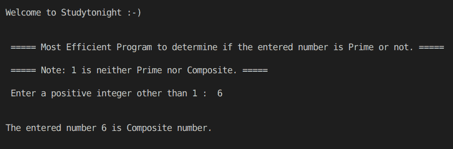
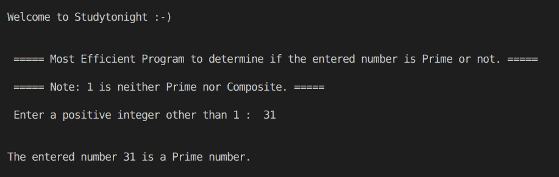

# C++确定数字是质数还是合数

> 原文：<https://www.studytonight.com/cpp-programs/cpp-determine-if-the-number-is-prime-or-composite>

大家好！

在本教程中，我们将学习**如何在 C++编程语言中检查给定的数字是 Prime 还是 Composite** 。

<u>**代号:**</u>

```cpp
#include <iostream>
#include <math.h>

using namespace std;

//Returns true if the given number is a Prime number
bool isPrime(int n)
{
    if (n == 1)
        return false; // as 1 is not a prime number

    for (int i = 2; i <= sqrt(n); i++) // Complexity O(SquareRoot(n))
    {
        if (n % i == 0)
            return false;
    }

    return true;
}

int main()
{
    cout << "\n\nWelcome to Studytonight :-)\n\n\n";
    cout << " ===== Most Efficient Program to determine if the entered number is Prime or not. ===== \n\n";

    cout << " ===== Note: 1 is neither Prime nor Composite. ===== \n\n";

    //variable declaration
    int n;
    bool prime = false;

    //taking input from the command line (user)
    cout << " Enter a positive integer other than 1 :  ";
    cin >> n;

    //Calling a method that returns true if the number is Prime
    prime = isPrime(n);

    if (prime)
    {
        cout << "\n\nThe entered number " << n << " is a Prime number.";
    }
    else
    {
        cout << "\n\nThe entered number " << n << " is Composite number.";
    }

    cout << "\n\n\n";

    return 0;
} 
```

<u>**输出:**</u>



让我们尝试另一种输入，



我们希望这篇文章能帮助你更好地理解如何在 C++中检查给定的数字是 Prime 还是 Composite。如有任何疑问，请随时通过下面的评论区联系我们。

**继续学习:**

* * *

* * *