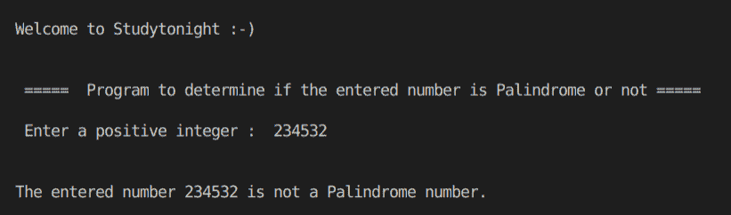
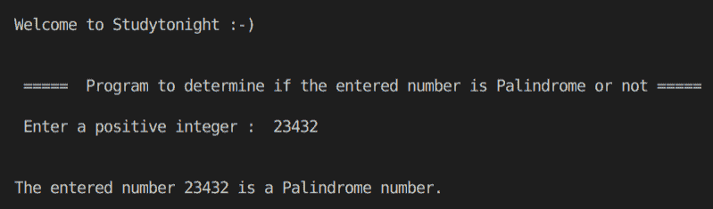

# C++给定数字的回文检查

> 原文：<https://www.studytonight.com/cpp-programs/cpp-palindrome-check-for-a-given-number>

大家好！

在本教程中，我们将学习如何在 C++编程语言中**检查给定的数字是否是回文**。

**要回文的数字的条件:**

一个等于其倒数的数。

**检查数字是否为回文的步骤:**

1.  计算给定数字的倒数。

2.  如果数等于它的倒数，它就是回文，否则不是。

<u>**代号:**</u>

```cpp
#include <iostream>
#include <math.h>

using namespace std;

//Returns true if the given number is a Palindrome number
bool isPalindrome(int n)
{
    int reverse = 0; //to store the reverse of the given number
    int remainder = 0;

    int n1 = n; //storing the original number for comparing later
    //logic to compute the reverse of a number
    while (n != 0)
    {
        remainder = n % 10;
        reverse = reverse * 10 + remainder;
        n /= 10;
    }

    if (reverse == n1)
        return true;
    else
        return false;
}

int main()
{
    cout << "\n\nWelcome to Studytonight :-)\n\n\n";
    cout << " =====  Program to determine if the entered number is Palindrome or not ===== \n\n";

    //variable declaration
    int n;
    bool palindrome = false;

    //taking input from the command line (user)
    cout << " Enter a positive integer :  ";
    cin >> n;

    //Calling a method that returns true if the number is Palindrome
    palindrome = isPalindrome(n);

    if (palindrome)
    {
        cout << "\n\nThe entered number " << n << " is a Palindrome number.";
    }
    else
    {
        cout << "\n\nThe entered number " << n << " is not a Palindrome number.";
    }

    cout << "\n\n\n";

    return 0;
}
```

<u>**输出:**</u>



让我们尝试另一种输入，



我们希望这篇文章能帮助你更好地理解如何在 C++中检查给定的数字是不是回文。如有任何疑问，请随时通过下面的评论区联系我们。

**继续学习:**

* * *

* * *