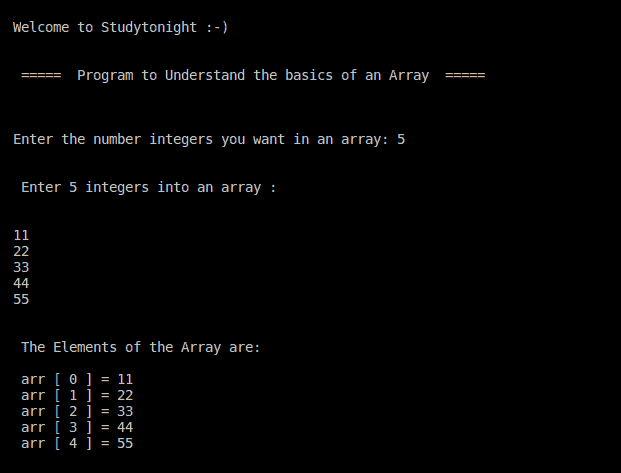

# C++中的数组介绍

> 原文：<https://www.studytonight.com/cpp-programs/introduction-to-arrays-in-cpp>

大家好！

在本教程中，我们将学习和理解 C++编程语言中数组数据结构的**基础知识。**

## C++中的数组

在编程中，`arrays`被引用为**结构化的**数据类型。数组被定义为存储在连续存储单元中的同质数据的**有限有序集合。**

为了更好地理解这个概念，我们将推荐您访问:[C 语言中的数组](https://www.studytonight.com/c/arrays-in-c.php)，我们已经在这里详细讨论了这个概念。

下面给出的注释代码演示了 C++中数组数据结构的基础。

<u>**代号:**</u>

```cpp
#include <iostream>
using namespace std;

int main()
{
    cout << "\n\nWelcome to Studytonight :-)\n\n\n";
    cout << " =====  Program to Understand the basics of an Array  ===== \n\n";

    //i to iterate the outer loop and j for the inner loop
    int i, n;

    cout << "\n\nEnter the number integers you want in an array: ";
    cin >> n;

    //Declaring an array containing 'n' integers
    int arr[n];

    cout << "\n\n Enter " << n << " integers into an array :\n\n";

    for (i = 0; i < n; i++)
    {
        cin >> arr[i];
    }

    cout << "\n\n The Elements of the Array are: \n\n";

    for (i = 0; i < n; i++)
    {
        cout << " arr [ " << i << " ] = " << arr[i] << endl;
    }

    cout << "\n\n";

    return 0;
}
```

<u>**输出:**</u>



我们希望这篇文章能帮助您更好地理解 CPP 中数组数据结构的概念。如有任何疑问，请随时通过下面的评论区联系我们。

**继续学习:**

* * *

* * *