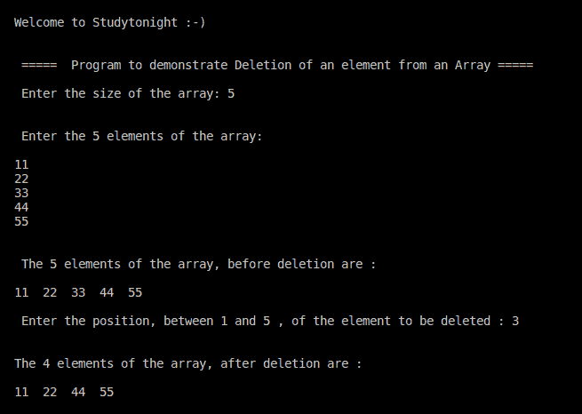

# C++ 程序：如何删除数组元素

> 原文：<https://www.studytonight.com/cpp-programs/cpp-how-to-delete-an-array-element>

大家好！

在本教程中，我们将学习如何在 C++ 编程语言中**删除特定位置**的数组元素。

让我们首先了解删除数组中的元素指的是什么。

删除是指从数组中删除一个元素，而不影响其他元素的顺序。这里的关键任务是确保一旦该元素被删除，其他元素将被相应地移动，以便它们仍然以连续的形式存储，从而遵循数组的属性。

### 逻辑:

一旦元素被移除，将跟随它的所有元素向前移动 1 个位置。这样，剩余的元素仍将以连续的形式存储。下面的代码将帮助您理解这个逻辑。

**代号:**

```cpp
#include <iostream>
using namespace std;

int main()
{
    cout << "\n\nWelcome to Studytonight :-)\n\n\n";
    cout << " =====  Program to demonstrate Deletion of an element from an Array ===== \n\n";

    int n;

    cout << " Enter the size of the array: ";
    cin >> n;

    int arr[n], i, pos;

    cout << "\n\n Enter the " << n << " elements of the array: \n\n";
    for(i=0; i<n; i++)
    {
        cin >> arr[i]; 
    }

    //Printing the original array before deletion
    cout << "\n\n The " << n << " elements of the array, before deletion are : \n\n";
    for(i=0; i<n; i++)
    {
        cout << arr[i] << "  "; 
    }

    cout << "\n\n Enter the position, between 1 and " << n << " , of the element to be deleted : ";
    cin >> pos;

    //Performing the deletion logic
    --pos;//as index of the element to be deleted is 1 less than it's position
    for (i = pos; i <= 9; i++)
    {
        arr[i] = arr[i + 1];
    }

    cout << " \n\nThe " << n-1 << " elements of the array, after deletion are : \n\n";
    for(i=0; i<n-1; i++)
    {
        cout << arr[i] << "  "; 
    }

    cout << "\n\n";

    return 0;
} 
```

**输出:**



我们希望这篇文章能帮助你更好地理解删除 CPP 中数组元素的概念。如有任何疑问，请随时通过下面的评论区联系我们。

**继续学习:**

* * *

* * *