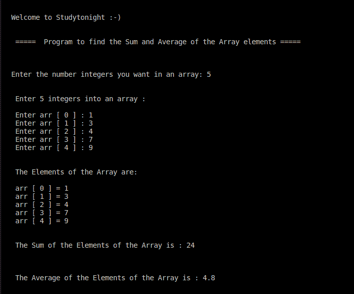

# C++ 程序：求数组元素的和与均值

> 原文：<https://www.studytonight.com/cpp-programs/find-sum-and-average-of-the-array-elements-in-cpp>

大家好！

在本教程中，我们将学习如何用 C++ 编程语言**找到数组元素**的和与平均值。

## C++ 中的数组

在编程中，`arrays`被称为**结构化**数据类型。数组被定义为存储在连续存储单元中的同质数据的**有限有序集合。**

为了更好地理解这个概念，我们建议您访问:[https://www.studytonight.com/c/arrays-in-c.php](https://www.studytonight.com/c/arrays-in-c.php)，我们在那里详细讨论了这个概念。

下面给出的注释代码演示了如何在 C++ 中访问数组的元素。

**代号:**

```cpp
#include <iostream>
using namespace std;

int main()
{
    cout << "\n\nWelcome to Studytonight :-)\n\n\n";
    cout << " =====  Program to find the Sum and Average of the Array elements ===== \n\n";

    //i to iterate the outer loop and j for the inner loop
    int i, n;

    //declaring sum and average as double because average can be a fractional value
    double sum=0, average=0;

    cout << "\n\nEnter the number integers you want in an array: ";
    cin >> n;

    //Declaring an array containing 'n' integers
    int arr[n];

    cout << "\n\n Enter " << n << " integers into an array :\n\n";

    for (i = 0; i < n; i++)
    {
        cout << " Enter arr [ " << i << " ] : ";
        cin >> arr[i];
    }

    cout << "\n\n The Elements of the Array are: \n\n";

    for (i = 0; i < n; i++)
    {
        cout << " arr [ " << i << " ] = " << arr[i] << endl;
        sum += arr[i];
    }

    average = sum/n;

    cout << "\n\n The Sum of the Elements of the Array is : " << sum << "\n\n";

    cout << "\n\n The Average of the Elements of the Array is : " << average << "\n\n";

    cout << "\n\n";

    return 0;
}
```

**输出:**



我们希望这篇文章能帮助你更好地理解数组的概念，并在 C++ 中访问它的元素。如有任何疑问，请随时通过下面的评论区联系我们。

**继续学习:**

* * *

* * *