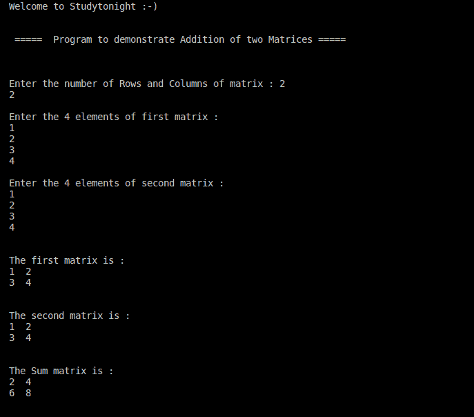

# 相加两个矩阵（2D 数组）的C++ 程序

> 原文：<https://www.studytonight.com/cpp-programs/cpp-program-to-add-two-matrices-2d-arrays>

大家好！

在本教程中，我们将学习如何用 C++ 编程语言**找到两个矩阵的加法(2D 数组)**。

## 矩阵加法:

矩阵加法是一种二元运算，通过将两个矩阵的**对应元素**相加，产生一个矩阵。

**约束**:对于矩阵加法，有一个必要条件——两个矩阵应该具有相同的维数，即相同的行数和列数。

结果矩阵的**维数与两个相加的矩阵的维数**相同。

一般来说，积矩阵的元素 **a[i][j]是通过将 m1[]i[j]和 m2[i][j]** 相加而形成的，即矩阵积的第一个元素是通过将两个矩阵的第一个元素(对应的元素)相加而得到的，第二个元素是通过将两个矩阵的第二个元素相加而形成的，以此类推。

为了更好地理解，请参考下面给出的注释良好的代码。

<u>**代号:**</u>

```cpp
#include <iostream>

using namespace std;

int main() {
    cout << "\n\nWelcome to Studytonight :-)\n\n\n";
    cout << " =====  Program to demonstrate Addition of two Matrices ===== \n\n";

    //loop variable i to iterate rows and j to iterate columns.
    int row, col, i, j;

    //Declaring the 3 matrices (2D arrays) m1-first matrix, m2- second matrix and sum- stores the addition of the two matrices
    int m1[10][10], m2[10][10], sum[10][10];

    cout << "\n\nEnter the number of Rows and Columns of matrix : ";
    cin >> row >> col;

    cout << "\nEnter the " << row * col << " elements of first matrix : \n";

    for (i = 0; i < row; i++) {
        for (j = 0; j < col; j++) {
            cin >> m1[i][j];
        }
    }

    cout << "\nEnter the " << row * col << " elements of second matrix : \n";

    for (i = 0; i < row; i++) {
        for (j = 0; j < col; j++) {
            cin >> m2[i][j];
        }
    }

    //calculating the sum matrix
    for (i = 0; i < row; i++) {
        for (j = 0; j < col; j++) {
            sum[i][j] = m1[i][j] + m2[i][j];
        }
    }

    cout << "\n\nThe first matrix is : \n";

    for (i = 0; i < row; i++) {
        for (j = 0; j < col; j++) {
            cout << m1[i][j] << "  ";
        }
        cout << endl;
    }

    cout << "\n\nThe second matrix is : \n";

    for (i = 0; i < row; i++) {
        for (j = 0; j < col; j++) {
            cout << m2[i][j] << "  ";
        }
        cout << endl;
    }

    cout << "\n\nThe Sum matrix is : \n";

    for (i = 0; i < row; i++) {
        for (j = 0; j < col; j++) {
            cout << sum[i][j] << "  ";
        }

        cout << endl;
    }

    cout << "\n\n";

    return 0;
}
```

<u>**输出:**</u>



我们希望这篇文章能帮助你更好地理解矩阵加法的概念及其在 C++ 中的实现。如有任何疑问，请随时通过下面的评论区联系我们。

**继续学习:**

* * *

* * *