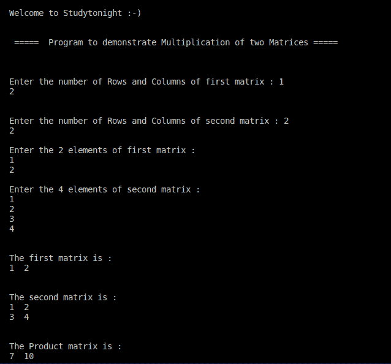

# 相乘两个矩阵（2D 数组）的 C++ 程序

> 原文：<https://www.studytonight.com/cpp-programs/cpp-program-multiplication-of-two-matrices-2d-arrays>

大家好！

在本教程中，我们将学习如何用 C++ 编程语言**找到两个矩阵的乘法(2D 数组)**。

## 矩阵乘法:

矩阵乘法是一种二进制运算，通过将两个矩阵相乘产生一个矩阵。

**约束**:对于矩阵乘法，有一个必要条件:第一个矩阵的列数必须等于第二个矩阵的行数。

结果矩阵具有第一个矩阵的行数和第二个矩阵的列数。

一般来说，积矩阵的一个元素 **a[i][j]是由两个数组 m1[i]和 m2[j]**的点积构成的，即矩阵积的第一个元素是取第一个矩阵的第一行与第二个矩阵的第一列的点积得到的，矩阵积的第二个元素是取第一个矩阵的第一行与第二个矩阵的第二列的点积得到的，以此类推。

为了更好地理解，请参考下面给出的注释良好的代码。

**代号:**

```cpp
#include <iostream>

using namespace std;

int main() {
    cout << "\n\nWelcome to Studytonight :-)\n\n\n";
    cout << " =====  Program to demonstrate Multiplication of two Matrices ===== \n\n";

    //loop variable i to iterate rows and j to iterate columns.
    int row1, col1, row2, col2, i, j, k;

    //Declaring the 3 matrices (2D arrays) m1-first matrix, m2- second matrix and pro- stores the multiplication of the two matrices
    int m1[10][10], m2[10][10], pro[10][10];

    cout << "\n\nEnter the number of Rows and Columns of first matrix : ";
    cin >> row1 >> col1;

    cout << "\n\nEnter the number of Rows and Columns of second matrix : ";
    cin >> row2 >> col2;

    //Matrix multiplication property
    if (col1 == row2) {
        cout << "\nEnter the " << row1 * col1 << " elements of first matrix : \n";

        for (i = 0; i < row1; i++) {
            for (j = 0; j < col1; j++) {
                cin >> m1[i][j];
            }
        }

        cout << "\nEnter the " << row2 * col2 << " elements of second matrix : \n";

        for (i = 0; i < row2; i++) {
            for (j = 0; j < col2; j++) {
                cin >> m2[i][j];
            }
        }

        // cout << "\n\n"
        //calculating the Product matrix - containing #rows and #columns of the 1st and the 2nd matrix respectively.
        for (i = 0; i < row1; i++) {
            for (j = 0; j < col2; j++) {
                pro[i][j] = 0;

                for (k = 0; k < col1; k++)
                    pro[i][j] = pro[i][j] + (m1[i][k] * m2[k][j]);
            }
        }

        cout << "\n\nThe first matrix is : \n";

        for (i = 0; i < row1; i++) {
            for (j = 0; j < col1; j++) {
                cout << m1[i][j] << "  ";
            }
            cout << endl;
        }

        cout << "\n\nThe second matrix is : \n";

        for (i = 0; i < row2; i++) {
            for (j = 0; j < col2; j++) {
                cout << m2[i][j] << "  ";
            }
            cout << endl;
        }

        cout << "\n\nThe Product matrix is : \n";

        for (i = 0; i < row1; i++) {
            for (j = 0; j < col2; j++) {
                cout << pro[i][j] << "  ";
            }
            cout << endl;
        }

    } else {
        cout << "\n\nMatrix multiplication can't be done as the indices do not match!";
    }

    cout << "\n\n";

    return 0;
}
```

**输出:**



我们希望这篇文章能帮助你更好地理解矩阵乘法的概念及其在 C++ 中的实现。如有任何疑问，请随时通过下面的评论区联系我们。

**继续学习:**

* * *

* * *