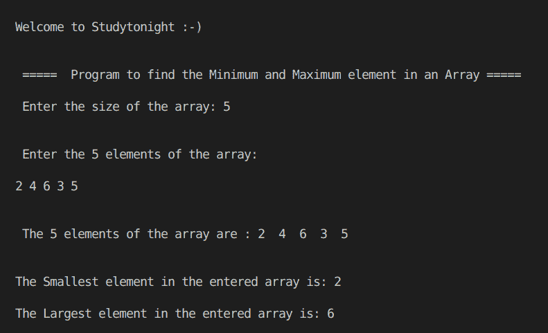

# 寻找数组中最小和最大元素的 C++程序

> 原文：<https://www.studytonight.com/cpp-programs/cpp-program-to-find-the-smallest-and-largest-element-in-an-array>

大家好！

在本教程中，我们将学习 C++编程语言中的**寻找数组中最小和最大的元素**。

要了解 STL 中的**数组容器，我们会推荐您访问:[https://www.studytonight.com/cpp/stl/stl-container-array](https://www.studytonight.com/cpp/stl/stl-container-array)，我们已经详细讨论过了。**

下面给出的注释代码将帮助您理解这个概念。

<u>**代号:**</u>

```cpp
#include <iostream>
using namespace std;

int findMinimum(int a[], int n)
{
    int mn = a[0]; //initializing minimum

    for (int i = 0; i < n; i++) // complexity O(n)
    {
        mn = min(mn, a[i]); //everytime storing the minimum among the current minimum and the current element
    }
    return mn;
}

int findMaximum(int a[], int n)
{
    int mx = a[0]; //initializing maximum

    for (int i = 0; i < n; i++) // complexity O(n)
    {
        mx = max(mx, a[i]); //everytime storing the maximum among the current maximum and the current element
    }
    return mx;
}

int main()
{
    cout << "\n\nWelcome to Studytonight :-)\n\n\n";
    cout << " =====  Program to find the Minimum and Maximum element in an Array ===== \n\n";

    int n;

    cout << " Enter the size of the array: ";
    cin >> n;

    int arr[n], i, pos;

    cout << "\n\n Enter the " << n << " elements of the array: \n\n";
    for (i = 0; i < n; i++)
    {
        cin >> arr[i];
    }

    //Printing the original array before deletion
    cout << "\n\n The " << n << " elements of the array are : ";
    for (i = 0; i < n; i++)
    {
        cout << arr[i] << "  ";
    }

    //Calling a method to find the smallest element
    int mn = findMinimum(arr, n);

    //Calling a method to find the largest element
    int mx = findMaximum(arr, n);

    cout << "\n\n\nThe Smallest element in the entered array is: " << mn;

    cout << "\n\nThe Largest element in the entered array is: " << mx << "\n\n\n";

    return 0;
} 
```

<u>**输出:**</u>

****

我们希望这篇文章能帮助你更好地理解在 C++中寻找数组中最小和最大元素的概念。如有任何疑问，请随时通过下面的评论区联系我们。

**继续学习:**

* * *

* * *