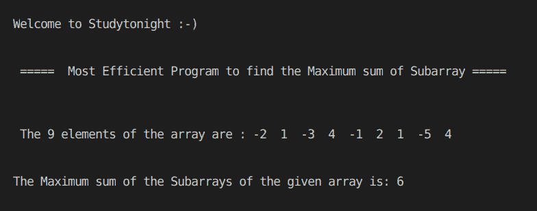

# 计算子数组最大和的 C++程序

> 原文：<https://www.studytonight.com/cpp-programs/cpp-program-to-compute-maximum-sum-of-the-subarray>

大家好！

在本教程中，我们将学习用 C++编程语言计算子数组最大和的最有效方法**。**

要了解 STL 中的**数组容器，我们会推荐您访问:[https://www.studytonight.com/cpp/stl/stl-container-array](https://www.studytonight.com/cpp/stl/stl-container-array)，我们已经详细讨论过了。**

下面给出的 CPP 编程语言代码借助注释详细解释了其中的每一个。

<u>**代号:**</u>

```cpp
#include <iostream>
#include <bits/stdc++.h>

using namespace std;

int maxSubArray(int m[], int n)
{

    int sum = 0, s = 0, i;

    for (i = 0; i < n; i++)
    {
        s += m[i];
        if (s < 0)
            s = 0;

        sum = max(s, sum);
    }

    //Sorting the array using the system defined sort() method
    sort(m, m + n);

    //if all the elements are negative then return the largest element of the array
    if (m[n - 1] < 0)
        sum = m[n - 1];

    return sum;
}

int main()
{
    cout << "\n\nWelcome to Studytonight :-)\n\n\n";
    cout << " =====  Most Efficient Program to find the Maximum sum of Subarray ===== \n\n";

    int i, n, sum = 0;

    int arr[] = {-2, 1, -3, 4, -1, 2, 1, -5, 4};

    //number of elements in the array
    n = sizeof(arr) / sizeof(arr[0]);

    //Printing the elements of the array
    cout << "\n\n The " << n << " elements of the array are : ";

    for (i = 0; i < n; i++)
    {
        cout << arr[i] << "  ";
    }

    //Calling a method to find the maximum sum of subarray
    sum = maxSubArray(arr, n);

    cout << "\n\n\nThe Maximum sum of the Subarrays of the given array is: " << sum;

    cout << "\n\n\n";

    return 0;
} 
```

<u>**输出:**</u>

****

我们希望这篇文章能帮助你更好地理解 C++中计算数组子数组最大和的逻辑。如有任何疑问，请随时通过下面的评论区联系我们。

**继续学习:**

* * *

* * *