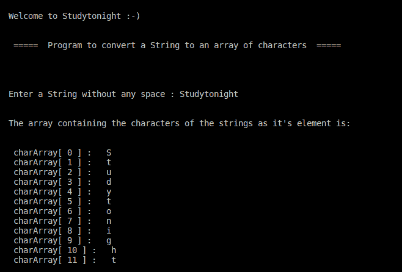

# 将字符串转换为字符数组的 C++程序

> 原文：<https://www.studytonight.com/cpp-programs/cpp-program-to-convert-string-to-array-of-characters>

大家好！

在本教程中，我们将学习如何**演示如何用 C++编程语言将给定的字符串转换成字符数组**。

## 逻辑:

这可以通过使用 **`c_str()`** 方法来实现。

**语法:**

```cpp
 //This is an in-built method defined within the string.h library
    strncpy(cArray, s.c_str(), sizeof(cArray));
```

为了更好地理解它的用例，请参考下面的代码。

<u>**代号:**</u>

```cpp
#include <iostream>

//This header file is used to make use of the strncpy() method
#include <string.h>

using namespace std;

int main()
{
    cout << "\n\nWelcome to Studytonight :-)\n\n\n";
    cout << " =====  Program to convert a String to an array of characters  ===== \n\n";

    string s;

    cout << "\n\nEnter a String without any space : ";
    cin >> s;

    cout << "\n\nThe array containing the characters of the strings as it's element is: "
         << "\n\n";

    //The array of characters to be printed
    char cArray[1024];

    //This is an in-built method defined within the string.h library
    strncpy(cArray, s.c_str(), sizeof(cArray));

    //Initializing all the elements of the array to 0, all at once.
    cArray[sizeof(cArray) - 1] = 0;

    //declaring the loop variable within the loop is syntactically correct, but it's scope remains limited to the loop.
    for (int i = 0; cArray[i] != 0; i++)
    {
        cout << "\n cArray[ " << i << " ] :   " << cArray[i];
    }

    cout << "\n\n";

    return 0;
} 
```

<u>**输出:**</u>



我们希望这篇文章能帮助你更好地理解在 C++中将字符串转换成字符数组的概念。如有任何疑问，请随时通过下面的评论区联系我们。

**继续学习:**

* * *

* * *