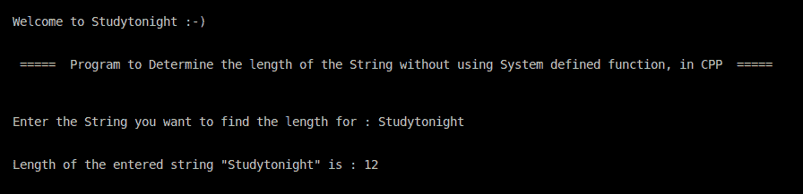

> 原文:[https://www . study south . com/CPP-programs/CPP-program-查找字符串长度不使用系统定义的方法](https://www.studytonight.com/cpp-programs/cpp-program-to-find-length-of-string-without-using-system-defined-method)

# 不使用系统定义方法求字符串长度的 C++程序

大家好！

在本教程中，我们将学习如何**演示如何在不使用系统定义方法**的情况下，在 C++编程语言中找到字符串的长度。

## 逻辑:

在编程中，字符串的末尾用一个称为**空**字符的特殊分隔符来表示。空字符或字符串终止字符由另一个字符转义序列“`\0`”表示。

因此，为了计算字符串的长度，我们需要从字符串的第一个字符开始遍历字符串，并不断增加计数器，直到遇到**空**字符，这将告诉我们字符串已经终止。

<u>**代号:**</u>

```cpp
#include <iostream>
#include <stdio.h>

using namespace std;

int main()
{
    cout << "\n\nWelcome to Studytonight :-)\n\n\n";
    cout << " =====  Program to Determine the length of the String without using System defined function, in CPP  ===== \n\n";

    //Variable Declaration
    char s1[100], c = 'a';
    int n = 0, i = 0;

    cout << "\n\nEnter the String you want to find the length for : ";
    cin >> s1;

    //Computing string length without using system defined method
    while (c != '\0')
    {
        c = s1[i];
        i++;
    }

    n = i - 1;

    cout << "\n\nLength of the entered string \"" << s1 << "\" is : " << n << "\n\n\n";

    return 0;
} 
```

<u>**输出:**</u>



我们希望这篇文章能帮助你更好地理解在 C++中不用系统定义的方法就能找到字符串长度的概念。如有任何疑问，请随时通过下面的评论区联系我们。

**继续学习:**

* * *

* * *