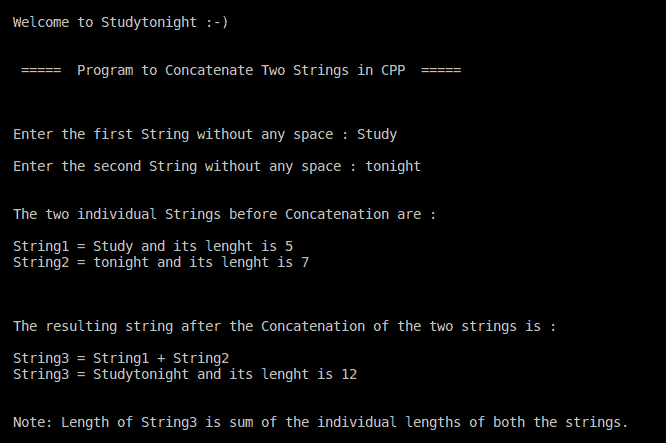

# C++ 程序：执行字符串连接

> 原文：<https://www.studytonight.com/cpp-programs/cpp-program-for-string-concatenation>

大家好！

在本教程中，我们将学习如何用 C++ 编程语言**连接用户输入的两个字符串**。

## 字符串串联:

在编程中，字符串连接是指将两个字符串组合成一个结果字符串，而不修改每个单独的字符串。

它是通过在两个字符串之间使用“ *+* ”运算符来执行的。

在串联操作之后，结果字符串的长度是两个单独字符串的总和。

### 示例:

String1 = **研究**

String2 = **今晚**

String3 = String1 + String2 = **今晚学习**

下面的代码演示了它在 C++ 中的实现。

**代号:**

```cpp
#include <iostream>

//This header file is used to make use of the strncpy() method
#include <string.h>

using namespace std;

int main()
{
    cout << "\n\nWelcome to Studytonight :-)\n\n\n";
    cout << " =====  Program to Concatenate Two Strings in CPP  ===== \n\n";

    //Variable Declaration
    string s1, s2, s3;

    cout << "\n\nEnter the first String without any space : ";
    cin >> s1;

    cout << "\nEnter the second String without any space : ";
    cin >> s2;

    cout << "\n\nThe two individual Strings before Concatenation are :\n\n";
    cout << "String1 = " << s1 << " and its lenght is " << s1.size() << "\n";
    cout << "String2 = " << s2 << " and its lenght is " << s2.size() << "\n\n";

    //Performing Concatenation of two strings using the + operator in CPP
    s3 = s1 + s2;

    cout << "\n\nThe resulting string after the Concatenation of the two strings is :\n\n";
    cout << "String3 = String1 + String2\n";
    cout << "String3 = " << s3 << " and its lenght is " << s3.size() << "\n\n";

    cout << "\nNote: Length of String3 is sum of the individual lengths of both the strings.";

    cout << "\n\n";

    return 0;
} 
```

**输出:**



我们希望这篇文章能帮助你更好地理解 C++ 中字符串连接的概念。如有任何疑问，请随时通过下面的评论区联系我们。

**继续学习:**

* * *

* * *