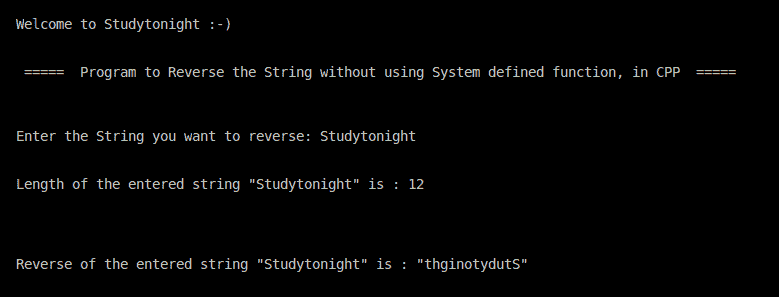

> 原文:[https://www . study south . com/CPP-programs/CPP-program-to-reverse-a-string 不使用系统定义的方法](https://www.studytonight.com/cpp-programs/cpp-program-to-reverse-a-string-without-using-system-defined-method)

# 不使用系统定义方法反转字符串的 C++程序

大家好！

在本教程中，我们将学习如何**演示如何在不使用系统定义方法**的情况下，在 C++编程语言中找到字符串的反义词。

## **查找字符串反向的步骤:**

1.  将要反转的字符串作为输入。

2.  初始化另一个相同长度的字符数组来存储字符串的反义词。

3.  从头到尾遍历输入字符串，并将每个字符存储在新创建的字符数组中。

<u>**代号:**</u>

```cpp
#include <iostream>
#include <stdio.h>

using namespace std;

int main()
{
    cout << "\n\nWelcome to Studytonight :-)\n\n\n";
    cout << " =====  Program to Reverse the String without using System defined function, in CPP  ===== \n\n";

    //Variable Declaration
    char s1[100], c = 'a';
    int n = 0, i = 0;

    cout << "\n\nEnter the String you want to reverse: ";
    cin >> s1;

    //Computing string length without using system defined method
    while (c != '\0')
    {
        c = s1[i];
        i++;
    }
    n = i - 1;

    cout << "\n\nLength of the entered string \"" << s1 << "\" is : " << n << "\n\n\n";

    //Declaring another char array to store the reverse of the string
    char s2[i];

    i = 0;
    //Logic to store the reverse of a string in another char array
    while (i != n + 1)
    {
        s2[i] = s1[n - i - 1];
        i++;
    }

    cout << "\n\nReverse of the entered string \"" << s1 << "\" is : \"" << s2 << "\"\n\n\n";

    return 0;
} 
```

<u>**输出:**</u>



我们希望这篇文章能帮助你更好地理解在 C++中不用系统定义的方法就能找到字符串的反义词的概念。如有任何疑问，请随时通过下面的评论区联系我们。

**继续学习:**

* * *

* * *