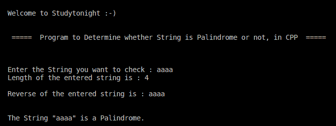

# C++ 程序：检查字符串回文

> 原文：<https://www.studytonight.com/cpp-programs/cpp-program-to-check-string-palindrome>

大家好！

在本教程中，我们将学习如何**演示如何在 C++ 编程语言中检查字符串是否是回文**。

### 字符串成为回文的条件:

如果一个字符串和它的反转相同，那么它就被认为是回文。

### 检查字符串回文的步骤:

1.  将要检查回文的字符串作为输入。

2.  初始化另一个相同长度的字符数组来存储字符串的反转。

3.  从头到尾遍历输入字符串，并将每个字符存储在新创建的字符数组中。

4.  如果旧的`char`数组的每个位置的字符与新的`char`数组相同，那么这个字符串就是一个**回文**。否则就不是。

**代号:**

```cpp
#include <iostream>
#include <stdio.h>

//This header file is used to make use of the system defined String methods.
#include <string.h>

using namespace std;

int main()
{
    cout << "\n\nWelcome to Studytonight :-)\n\n\n";
    cout << " =====  Program to Determine whether String is Palindrome or not, in CPP  ===== \n\n";

    //String Variable Declaration
    char s1[100], c = 'a';
    int n1, i = 0;

    cout << "\n\nEnter the String you want to check : ";
    cin >> s1;

    //Computing string length without using system defined method
    while (c != '\0')
    {
        c = s1[i++];
    }

    n1 = i-1;
    char s2[n1+1];

    cout << "Length of the entered string is : " << n1 << "\n\n";

    i = 0;
    //Computing reverse of the String without using system defined method
    while (i != n1 + 1)
    {
        s2[i] = s1[n1 - i - 1];
        i++;
    }

    cout << "Reverse of the entered string is : " << s2 << "\n\n\n";

    i = 0;
    //Logic to check for Palindrome
    while (i != n1)
    {
        if (s2[i] != s1[i])
            break;

        i++;
    }

    if (i != n1)
        cout << "The String \"" << s1 << "\"" << " is not a Palindrome.";
    else
        cout << "The String \"" << s1 << "\"" << " is a Palindrome.";

    cout << "\n\n";

    return 0;
} 
```

**输出:**



我们希望这篇文章能帮助你更好地理解如何在 C++ 中检查字符串是否是回文。如有任何疑问，请随时通过下面的评论区联系我们。

**继续学习:**

* * *

* * *