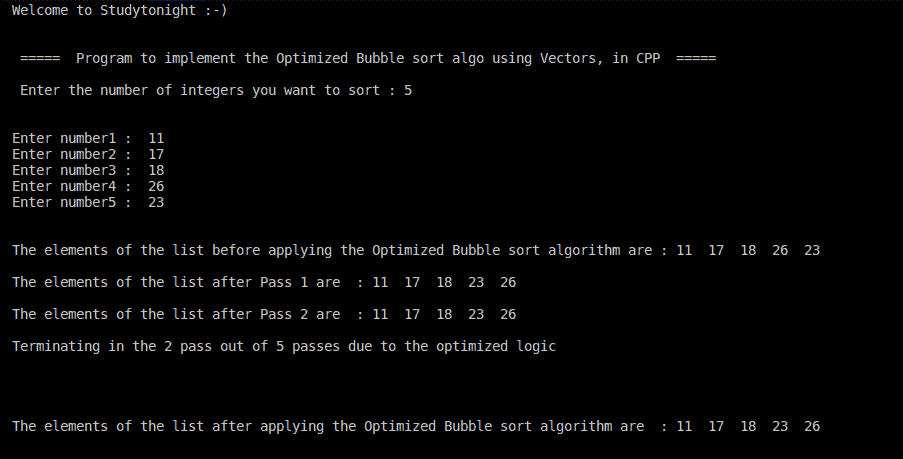

# C++ 程序：冒泡排序（优化）

> 原文：<https://www.studytonight.com/cpp-programs/cpp-program-for-bubble-sort-optimized>

大家好！

在本教程中，我们将学习如何用 C++ 编程语言实现**冒泡排序算法**的优化版本。

为了从头开始理解**冒泡排序算法**，我们强烈建议您首先访问我们的教程，因为我们已经介绍了它的逐步实现，这里:[https://www.studytonight.com/data-structures/bubble-sort](https://www.studytonight.com/data-structures/bubble-sort)

**代号:**

```cpp
#include <iostream>

#include<vector>

using namespace std;

//Global variable declaration so that the variables can be used/accessed within any of the methods
int n;
//Separate method to print the list provided by the calling method
void printElems(vector < int > list) {
    int i;
    for (i = 0; i < n; i++)
        cout << list[i] << "  ";

}

//The Optimized Bubble sort logic
void bubbleSort(vector < int > & a) {
    int i, j, k, swap, flag;
    int len = a.size();

    for (int i = len; i > 0; i--) {

        //initializing flag to 0 after each pass to check if swapping happens or not in a particular pass
        flag = 0;

        //Any number of variables can be used within the loop provided the syntax is correct.
        for (j = 0, k = 1; k < i; j++, k++) {
            if (a[j] > a[k]) {
                //Swap the elements as they are in opposite order
                swap = a[j];
                a[j] = a[k];
                a[k] = swap;

                // if swapping happens update flag to 1
                flag = 1;
            }

        }

        cout << "\n\nThe elements of the list after Pass " << n - i + 1 << " are  : ";
        printElems(a);

        if (flag == 0) {
            cout << "\n\nTerminating in the " << n - i + 1 << " pass out of " << n << " passes due to the optimized logic\n\n" << endl;
            break;
        }

    }

}

int main() {
    int i, num;

    //Declaring the Vector to store the integer elements to be sorted
    vector < int > v;

    cout << "\n\nWelcome to Studytonight :-)\n\n\n";
    cout << " =====  Program to implement the Optimized Bubble sort algo using Vectors, in CPP  ===== \n\n";

    //taking input from the command line (user)
    cout << " Enter the number of integers you want to sort : ";
    cin >> n;
    cout << "\n\n";

    for (i = 0; i < n; i++) {
        cout << "Enter number" << i + 1 << " :  ";
        cin >> num;
        v.push_back(num);

    }

    cout << "\n\nThe elements of the list before applying the Optimized Bubble sort algorithm are : ";

    //Calling the method to print the actual list
    printElems(v);

    //Calling the bubble sort algorithm
    bubbleSort(v);

    cout << "\n\nThe elements of the list after applying the Optimized Bubble sort algorithm are  : ";

    //Calling the method to print the sorted list
    printElems(v);

    cout << "\n\n\n";

    return 0;
}
```

**输出 1:** 这个场景将向你解释拥有一个**优化的冒泡排序算法**的必要性，如果列表在两者之间排序，它可以终止程序，而不是一遍又一遍地执行直到结束。



在上面的例子中，列表**在第一遍**之后被排序，所以在第二遍中，没有**交换**，因此我们的优化算法理解列表已经被排序，并在这一遍中终止程序，而不是让它执行到最后一遍。

为了更好的理解，你可以参考我们这里的一个教程:[https://www.studytonight.com/data-structures/bubble-sort](https://www.studytonight.com/data-structures/bubble-sort)

如有任何疑问，欢迎在下方评论区提问！

**继续学习:**

* * *

* * *