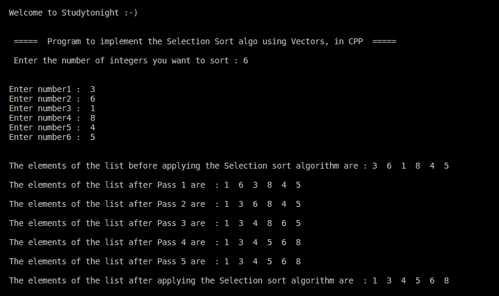

# C++ 程序：选择排序

> 原文：<https://www.studytonight.com/cpp-programs/cpp-program-for-selection-sort>

大家好！

在本教程中，我们将学习如何用 C++ 编程语言实现**选择排序算法**。

为了从头开始理解**选择排序算法**，我们强烈建议您首先在同一天访问我们的教程，因为我们已经介绍了它的逐步实现，这里:[https://www . study south . com/data-structures/Selection-sorting](https://www.studytonight.com/data-structures/selection-sorting)

**代号:**

```cpp
#include <iostream>

#include<vector>

using namespace std;

//Separate method to print the list provided by the calling method
void printElems(vector < int > list) {
    int i;
    int len = list.size();
    for (i = 0; i < len; i++)
        cout << list[i] << "  ";

}

//The Selection sort logic
void selectionSort(vector < int > & a) {
    int i, min, k, swap, location;
    int len = a.size();

    for (i = 0; i < len - 1; i++) {
        min = a[i];
        location = i;

        for (k = i + 1; k < len; k++) {
            if (min > a[k]) {
                min = a[k];
                location = k;
            }
        }

        //Putting the minimum value of each pass to its correct location
        swap = a[i];
        a[i] = a[location];
        a[location] = swap;

        cout << "\n\nThe elements of the list after Pass " << i + 1 << " are  : ";
        printElems(a);

    }

}

int main() {
    int i, num, n;

    //Declaring the Vector to store the integer elements to be sorted
    vector < int > v;

    cout << "\n\nWelcome to Studytonight :-)\n\n\n";
    cout << " =====  Program to implement the Selection Sort algo using Vectors, in CPP  ===== \n\n";

    //taking input from the command line (user)
    cout << " Enter the number of integers you want to sort : ";
    cin >> n;
    cout << "\n\n";

    for (i = 0; i < n; i++) {
        cout << "Enter number" << i + 1 << " :  ";
        cin >> num;
        v.push_back(num);

    }

    cout << "\n\nThe elements of the list before applying the Selection sort algorithm are : ";

    //Calling the method to print the actual list
    printElems(v);

    //Calling the bubble sort algorithm
    selectionSort(v);

    cout << "\n\nThe elements of the list after applying the Selection sort algorithm are  : ";

    //Calling the method to print the sorted list
    printElems(v);

    cout << "\n\n\n";

    return 0;
}
```

**输出:**



如有任何疑问，欢迎在下方评论区提问！

**继续学习:**

* * *

* * *