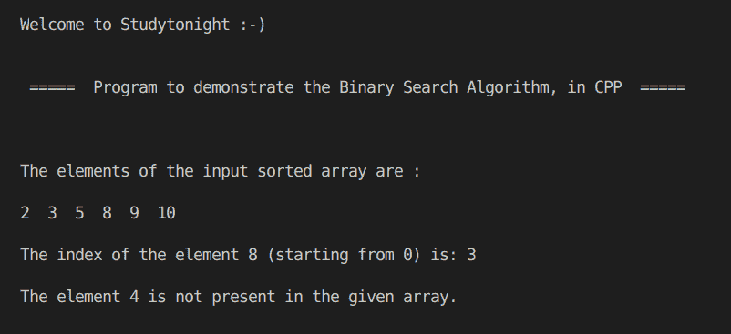

# 二分搜索法算法的 C++ 程序

> 原文：<https://www.studytonight.com/cpp-programs/cpp-program-for-binary-search-algorithm>

大家好！

在本教程中，我们将学习如何用 C++ 编程语言**实现二分搜索法算法**。

为了详细了解二分搜索法的概念，我们将推荐您访问[https://www . study south . com/data-structures/binary-search-algorithm](https://www.studytonight.com/data-structures/binary-search-algorithm)，我们已经在这里详细解释了这些概念。

为了更好地理解，请参考下面给出的评论良好的 CPP 代码。

<u>**代号:**</u>

```cpp
#include <iostream>
#include <vector>
using namespace std;

//Program to return the index of b in the vector a
int BS(int a[], int l, int h, int b)
{
    int res = -1;
    while (l <= h)
    {
        int m = (l + h) / 2;

        if (a[m] == b)
        {
            return m;
        }
        else if (a[m] > b)
        {
            h = m - 1;
        }
        else
        {
            l = m + 1;
        }
    }

    return -1;
}

int main()
{
    cout << "\n\nWelcome to Studytonight :-)\n\n\n";
    cout << " =====  Program to demonstrate the Binary Search Algorithm, in CPP  ===== \n\n";

    int i, n;
    int a[] = {2, 3, 5, 8, 9, 10};

    n = sizeof(a) / sizeof(a[0]);

    cout << "\n\nThe elements of the input sorted array are :\n\n";

    for (i = 0; i < n; i++)
    {
        cout << a[i] << "  ";
    }

    int k1 = 8; //the element to find the index of

    //Calling BS() method to return the index of the element k1 if present, else -1.
    int f1 = BS(a, 0, n - 1, k1);

    if (f1 == -1)
    {
        cout << "\n\nThe element " << k1 << " is not present in the given array. ";
    }
    else
    {
        cout << "\n\nThe index of the element " << k1 << " (starting from 0) is: " << f1;
    }

    int k2 = 4; //the element to find the index of

    //Calling BS() method to return the index of the element k2 if present, else -1.
    int f2 = BS(a, 0, n - 1, k2);

    if (f2 == -1)
    {
        cout << "\n\nThe element " << k2 << " is not present in the given array. ";
    }
    else
    {
        cout << "\n\nThe index of the element " << k2 << " (starting from 0) is: " << f2;
    }

    cout << "\n\n\n";

    return 0;
} 
```

<u>**输出:**</u>



我们希望这篇文章能帮助你更好地理解二分搜索法算法的概念及其在 CPP 中的实现。如有任何疑问，请随时通过下面的评论区联系我们。

**继续学习:**

* * *

* * *