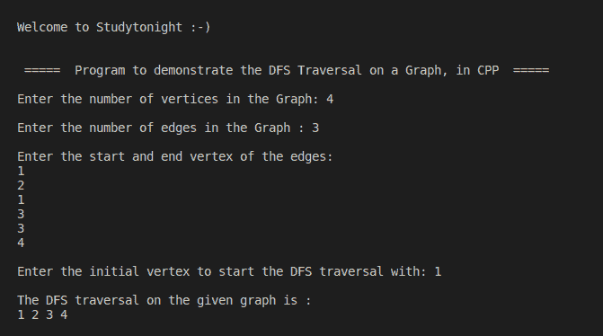

# 面向 DFS 遍历的 C++程序

> 原文：<https://www.studytonight.com/cpp-programs/cpp-program-for-dfs-traversal>

大家好！

在本教程中，我们将学习如何用 C++编程语言**在图**上实现 DFS 遍历。

## 什么是 DFS 遍历？

顾名思义，深度优先搜索算法从起始节点开始，然后遍历图的每个分支，直到找到没有子节点的叶节点。然后，该算法回溯到尚未完全探索的最新节点。重复这个过程，直到图的所有节点都被访问或探索。

DFS 中使用的数据结构是**栈**。要了解更多关于堆栈数据结构的信息，我们建议您访问[https://www . study south . com/data-structures/Stack-data-structure](https://www.studytonight.com/data-structures/stack-data-structure)，我们已经在这里详细解释了这些概念。

为了更好地理解，请参考下面给出的注释良好的 C++代码。

<u>**代号:**</u>

```cpp
#include <iostream>
#include<vector>
using namespace std;

int main()
{
    cout << "\n\nWelcome to Studytonight :-)\n\n\n";
    cout << " =====  Program to demonstrate the DFS Traversal on a Graph, in CPP  ===== \n\n";

    //variable declaration
    int cost[10][10], i, j, k, n, e, top, v, stk[10], visit[10], visited[10];

    cout << "Enter the number of vertices in the Graph: ";
    cin >> n;
    cout << "\nEnter the number of edges in the Graph : ";
    cin >> e;
    cout << "\nEnter the start and end vertex of the edges: \n";

    for (k = 1; k <= e; k++)
    {
        cin >> i >> j;
        cost[i][j] = 1;
    }

    cout << "\nEnter the initial vertex to start the DFS traversal with: ";
    cin >> v;
    cout << "\nThe DFS traversal on the given graph is : \n";
    cout << v << " ";

    //As we start with the vertex v, marking it visited to avoid visiting again
    visited[v] = 1;

    k = 1;

    //The DFS Traversal Logic
    while (k < n)
    {
        for (j = n; j >= 1; j--)
        {
            if (cost[v][j] != 0 && visited[j] != 1 && visit[j] != 1)
            {
                visit[j] = 1;

                //put all the vertices that are connected to the visited vertex into a stack
                stk[top] = j;
                top++;
            }
        }

        //output all the connected vertices one at a time
        v = stk[--top];
        cout << v << " ";
        k++;

        //as v is visited so it is not a valid candidate to visit in future so visit[v]=0 and visited[v]=1
        visit[v] = 0;

        //to mark it visited 
        visited[v] = 1;
    }

        cout << "\n\n\n";

    return 0;
} 
```

<u>**输出:**</u>



我们希望这篇文章能帮助您更好地理解 DFS 遍历的概念及其在 C++中的实现。如有任何疑问，请随时通过下面的评论区联系我们。

**继续学习:**

* * *

* * *